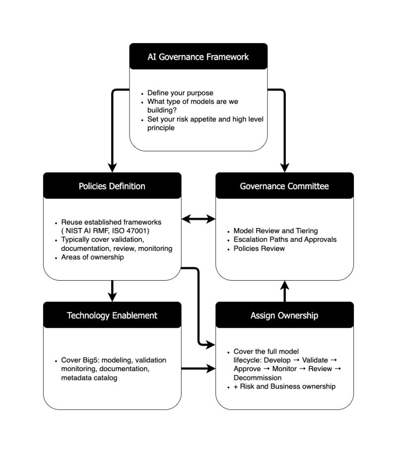

# Getting Started with AI Governance

Establishing effective AI governance is increasingly recognized as essential, not only in highly regulated sectors such as technology, banking, and finance, but across all organizations deploying AI and machine learning (ML) systems. While the process may appear complex, building robust governance capabilities is a critical investment for long-term success and risk management.

## Steps to Establish an AI/ML Governance Framework

### 1. Define an AI/ML Governance Strategy
- **Purpose**: Clearly articulate the objectives of your AI/ML initiatives, such as trust, explainability, and regulatory compliance.
- **Scope**: Identify the types of models being developed and deployed, and clarify ownership of associated risks.
- **Principles**: Establish your organization's risk appetite and responsible AI principles, including positions on large language models (LLMs) and autonomous systems.

### 2. Develop Model Governance Standards and Policies
- **Framework Selection**: Leverage established frameworks (e.g., NIST AI RMF, ISO 42001) as a foundation, adapting them to your organizational context.
- **Validation**: Standardize processes for model validation, including bias detection, robustness, explainability, and performance assessment.
- **Documentation**: Ensure comprehensive documentation of model design, assumptions, data sources, and performance metrics.
- **Monitoring and Review**: Implement mechanisms for ongoing monitoring, periodic reviews, and support.

### 3. Assign Roles and Model Lifecycle Ownership
- **Responsibility Assignment**: Define clear responsibilities across the model lifecycle: development, validation, approval, monitoring, review, and decommissioning.
- **Stakeholder Inclusion**: Involve key stakeholders such as modelers, operations, risk, and business units to ensure comprehensive oversight.
- **Leadership**: Appoint a model or risk owner to oversee policy adherence and present critical decisions to the governance committee.

### 4. Enable Technology for AI Governance
- **Tool Selection**: Adopt appropriate tools for model tracking (e.g., MLflow, Vectice), metadata management (e.g., Colibra, Vectice), documentation (e.g., Confluence, Vectice), validation, and monitoring (e.g., Arize, Fiddler).
- **Integration**: Ensure that technology solutions support the needs of all relevant roles and facilitate seamless governance processes.

### 5. Establish Governance Committees and Metrics
- **Committee Formation**: Create a governance committee with executive representation to oversee approvals, reviews, and escalations.
- **Balanced Oversight**: Strive for a balance between effective oversight and organizational agility, ensuring the committee adds value without impeding progress.

## Continuous Improvement
AI governance is an iterative process. Organizations should focus on continuous improvement, regularly updating governance practices to reflect evolving risks, technologies, and regulatory requirements.

## AI Governance

A visual representation of a typical AI Governance Framework is provided below:

**Figure:** AI Governance Framework. This diagram illustrates the relationships between key governance components, including framework definition, policy development, committee oversight, technology enablement, and ownership assignment.

*References author: [Gregory Haardt](https://www.linkedin.com/in/gregoryhaardt/)*