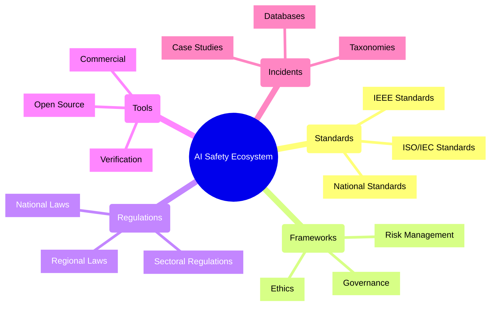
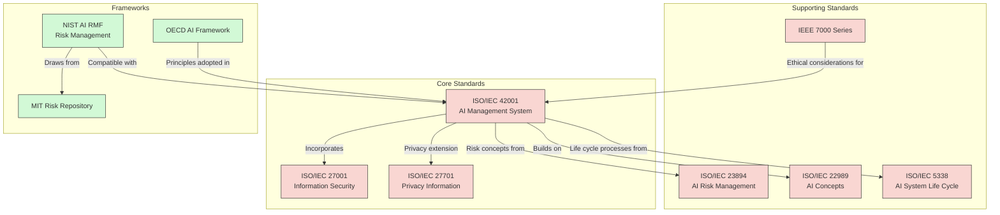
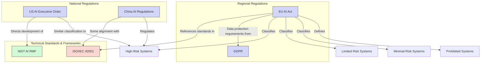
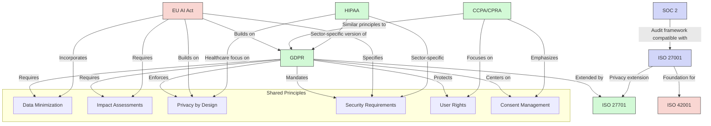
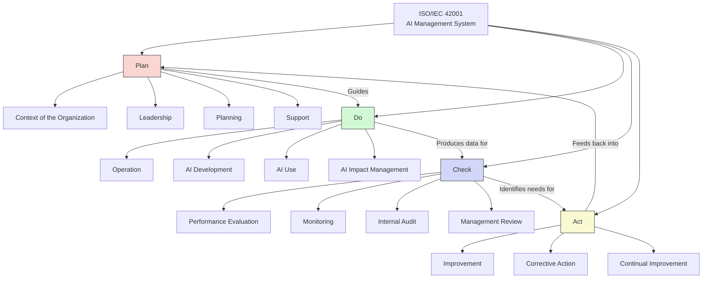

# AI Safety Mental Map

This document provides a detailed mental map of how AI safety frameworks, standards, and regulations relate to each other. The goal is to help developers, regulators, and organizations navigate the complex landscape of AI governance.

## Core Components of the AI Safety Ecosystem

The AI safety ecosystem consists of several interconnected components:



## Relationship Between Standards and Frameworks



## Regulatory Landscape and Its Connections



## Timeline and Evolution Flowchart

```mermaid
flowchart TD
    classDef oldnodes fill:#f9d6d2,stroke:#333,stroke-width:1px
    classDef newnodes fill:#d2f9d6,stroke:#333,stroke-width:1px
    
    %% 2018
    GDPR2018[GDPR Enforcement 2018]:::oldnodes
    GOOGLE2018[Google AI Principles 2018]:::oldnodes
    IBM2018[IBM AI Fairness 360 2018]:::oldnodes
    
    %% 2019-2020
    IEEE2019[IEEE Ethics Guidelines 2019]:::oldnodes
    SING2019[Singapore AI Governance 2019]:::oldnodes
    SING2020[Singapore PDPC AI Ethics 2020]:::oldnodes
    
    %% 2021-2022
    ISO24029_2021[ISO/IEC 24029 Neural Networks 2021]:::oldnodes
    OECD2022[OECD AI Systems Classification 2022]:::oldnodes
    ISO5338_2022[ISO/IEC 5338 AI Life Cycle 2022]:::oldnodes
    ISO38507_2022[ISO/IEC 38507 Governance 2022]:::oldnodes
    BILL2022[US AI Bill of Rights 2022]:::oldnodes
    
    %% 2023
    ISO42001_2023[ISO/IEC 42001 AI Management 2023]:::newnodes
    ISO23894_2023[ISO/IEC 23894 Risk Management 2023]:::newnodes
    NISTRMF2023[NIST AI RMF 2023]:::newnodes
    CHINA2023[China AI Regulations 2023]:::newnodes
    USEO2023[US AI Executive Order 2023]:::newnodes
    
    %% 2024+
    EUAI2024[EU AI Act 2024]:::newnodes
    ISO24027_2024[ISO/IEC 24027 Bias 2024-2025]:::newnodes
    
    %% Relationships
    GDPR2018 -->|Influenced| EUAI2024
    IEEE2019 -->|Concepts adopted in| ISO42001_2023
    
    ISO24029_2021 -->|Technical foundation for| ISO42001_2023
    ISO5338_2022 -->|Life cycle processes adopted in| ISO42001_2023
    ISO38507_2022 -->|Governance principles for| ISO42001_2023
    
    NISTRMF2023 -->|Influenced| USEO2023
    NISTRMF2023 -->|Compatible with| ISO42001_2023
    
    BILL2022 -->|Concepts developed in| USEO2023
    
    EUAI2024 -->|May reference| ISO42001_2023
    EUAI2024 -->|Builds on| GDPR2018
```



## Risk Dimensions and Control Frameworks

```mermaid
graph TD
    classDef technical fill:#f9d6d2,stroke:#333,stroke-width:1px
    classDef ethical fill:#d2f9d6,stroke:#333,stroke-width:1px
    classDef operational fill:#d2d6f9,stroke:#333,stroke-width:1px
    classDef strategic fill:#f9f9d2,stroke:#333,stroke-width:1px
    
    RISK[AI Risk Dimensions]
    
    TECH[Technical Risks]:::technical
    ETHIC[Ethical Risks]:::ethical
    OPER[Operational Risks]:::operational
    STRAT[Strategic Risks]:::strategic
    
    RISK --> TECH
    RISK --> ETHIC
    RISK --> OPER
    RISK --> STRAT
    
    %% Technical risks
    TECH --> TECH1[Model Drift]
    TECH --> TECH2[Security Vulnerabilities]
    TECH --> TECH3[Performance Degradation]
    TECH --> TECH4[Adversarial Attacks]
    
    %% Ethical risks
    ETHIC --> ETHIC1[Fairness Issues]
    ETHIC --> ETHIC2[Transparency Problems]
    ETHIC --> ETHIC3[Privacy Violations]
    ETHIC --> ETHIC4[Societal Impact]
    
    %% Operational risks
    OPER --> OPER1[Integration Failures]
    OPER --> OPER2[Workflow Disruptions]
    OPER --> OPER3[Human-AI Interaction Issues]
    OPER --> OPER4[Monitoring Gaps]
    
    %% Strategic risks
    STRAT --> STRAT1[Reputational Damage]
    STRAT --> STRAT2[Regulatory Non-compliance]
    STRAT --> STRAT3[Market Disruption]
    STRAT --> STRAT4[Stakeholder Mistrust]
    
    %% Controls
    ISO[ISO Standards]
    NIST[NIST Framework]
    
    ISO --> |Controls for| TECH
    ISO --> |Controls for| ETHIC
    ISO --> |Controls for| OPER
    ISO --> |Controls for| STRAT
    
    NIST --> |Controls for| TECH
    NIST --> |Controls for| ETHIC
    NIST --> |Controls for| OPER
    NIST --> |Controls for| STRAT
```



## Relationship to Other Privacy and Security Regulations



## The NIST AI Risk Management Framework (AI RMF)

```mermaid
flowchart TD
    classDef map fill:#f9d6d2,stroke:#333,stroke-width:1px
    classDef measure fill:#d2f9d6,stroke:#333,stroke-width:1px
    classDef manage fill:#d2d6f9,stroke:#333,stroke-width:1px
    classDef govern fill:#f9f9d2,stroke:#333,stroke-width:1px
    
    NISTRMF[NIST AI RMF]
    
    MAP[MAP]:::map
    MEASURE[MEASURE]:::measure
    MANAGE[MANAGE]:::manage
    GOVERN[GOVERN]:::govern
    
    NISTRMF --> MAP
    NISTRMF --> MEASURE
    NISTRMF --> MANAGE
    NISTRMF --> GOVERN
    
    %% MAP function
    MAP --> MAP1[Establish Context]
    MAP --> MAP2[Identify AI Systems]
    MAP --> MAP3[Analyze Impacts]
    MAP --> MAP4[Define Risk Types]
    
    %% MEASURE function
    MEASURE --> MEASURE1[Assess Risk]
    MEASURE --> MEASURE2[Categorize Risk]
    MEASURE --> MEASURE3[Map to Controls]
    MEASURE --> MEASURE4[Document Risk]
    
    %% MANAGE function
    MANAGE --> MANAGE1[Prioritize Risks]
    MANAGE --> MANAGE2[Plan Treatments]
    MANAGE --> MANAGE3[Implement Controls]
    MANAGE --> MANAGE4[Monitor Effectiveness]
    
    %% GOVERN function
    GOVERN --> GOVERN1[Define Governance]
    GOVERN --> GOVERN2[Define Risk Tolerance]
    GOVERN --> GOVERN3[Establish Oversight]
    GOVERN --> GOVERN4[Create Documentation]
    
    MAP1 -->|Feeds into| MEASURE1
    MEASURE4 -->|Informs| MANAGE1
    MANAGE4 -->|Reports to| GOVERN3
    GOVERN2 -->|Guides| MAP3
```



## The ISO/IEC 42001 AI Management System



## EU AI Act Risk Classification System

```mermaid
graph TD
    classDef prohibited fill:#ff9999,stroke:#333,stroke-width:1px
    classDef highrisk fill:#ffcc99,stroke:#333,stroke-width:1px
    classDef limited fill:#99ff99,stroke:#333,stroke-width:1px
    classDef minimal fill:#9999ff,stroke:#333,stroke-width:1px
    
    EUAI[EU AI Act<br>Risk Classification]
    
    PROHIBITED[Prohibited AI Systems]:::prohibited
    HIGHRISK[High-Risk AI Systems]:::highrisk
    LIMITED[Limited Risk AI Systems]:::limited
    MINIMAL[Minimal/No Risk AI Systems]:::minimal
    
    EUAI --> PROHIBITED
    EUAI --> HIGHRISK
    EUAI --> LIMITED
    EUAI --> MINIMAL
    
    %% Prohibited AI
    PROHIBITED --> PROHIBITED1[Social Scoring]
    PROHIBITED --> PROHIBITED2[Manipulation]
    PROHIBITED --> PROHIBITED3[Exploit Vulnerabilities]
    PROHIBITED --> PROHIBITED4[Real-time Biometric ID]
    
    %% High-Risk AI
    HIGHRISK --> HIGHRISK1[Critical Infrastructure]
    HIGHRISK --> HIGHRISK2[Education & Vocational]
    HIGHRISK --> HIGHRISK3[Employment]
    HIGHRISK --> HIGHRISK4[Essential Services]
    HIGHRISK --> HIGHRISK5[Law Enforcement]
    HIGHRISK --> HIGHRISK6[Migration & Border]
    HIGHRISK --> HIGHRISK7[Administration of Justice]
    HIGHRISK --> HIGHRISK8[Democratic Processes]
    
    %% Limited Risk AI
    LIMITED --> LIMITED1[Chatbots]
    LIMITED --> LIMITED2[Emotion Recognition]
    LIMITED --> LIMITED3[Biometric Categorization]
    LIMITED --> LIMITED4[Content Generation]
    
    %% Minimal Risk AI
    MINIMAL --> MINIMAL1[AI-enabled Video Games]
    MINIMAL --> MINIMAL2[Spam Filters]
    MINIMAL --> MINIMAL3[Inventory Management]
    MINIMAL --> MINIMAL4[Other Low-Risk Applications]
    
    %% Requirements mapping
    HIGHRISK -->|Requires| REQ1[Risk Management]
    HIGHRISK -->|Requires| REQ2[Data Governance]
    HIGHRISK -->|Requires| REQ3[Technical Documentation]
    HIGHRISK -->|Requires| REQ4[Record Keeping]
    HIGHRISK -->|Requires| REQ5[Transparency]
    HIGHRISK -->|Requires| REQ6[Human Oversight]
    HIGHRISK -->|Requires| REQ7[Accuracy & Robustness]
    
    LIMITED -->|Requires| TRANS[Transparency Obligations]
