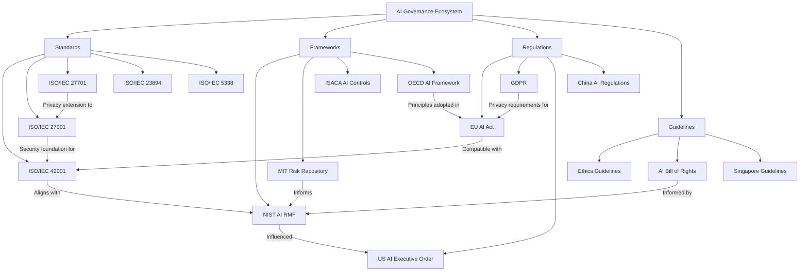
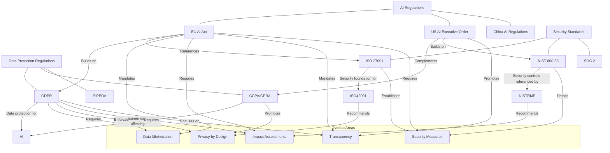
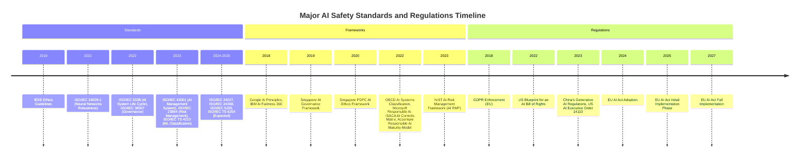

# Awesome Guide to AI Safety

A comprehensive collection of resources, frameworks, standards, regulations, and tools related to AI safety and governance.

## Table of Contents
- [ISO Standards for AI Safety](#iso-standards-for-ai-safety)
- [AI Safety Tools](#ai-safety-tools)
  - [Open Source Tools](#open-source-tools)
  - [AI Security Tools](#ai-security-tools)
  - [Commercial Tools](#commercial-tools)
- [AI Risk Frameworks](#ai-risk-frameworks)
- [AI Regulations](#ai-regulations)
- [OWASP Top 10 for LLM Applications](#owasp-top-10-for-llm-applications)
- [AI Incident Sources](#ai-incident-sources)
- [National CERTs and Organizations Addressing AI Security](#national-certs-and-organizations-addressing-ai-security)
- [Framework Relationships](#framework-relationships)
- [Relationship to Other Regulations](#relationship-to-other-regulations)
- [Timeline of Standards and Regulations](#timeline-of-standards-and-regulations)

## ISO Standards for AI Safety

| Standard | Title | Description | Status |
|----------|-------|-------------|--------|
| ISO/IEC 42001 | Information technology — Artificial intelligence — Management system | Provides requirements for an AI management system, focusing on responsible development and use of AI | Published 2023 |
| ISO/IEC TS 4213 | Assessment of machine learning classification performance | Provides a methodology for assessment of ML classification performance | Published 2023 |
| ISO/IEC 23894 | AI Risk Management | Guidance on managing risks to organizations related to AI systems | Published 2023 |
| ISO/IEC 24027 | Bias in AI systems and AI aided decision making | Guidelines addressing bias in AI systems | Under development |
| ISO/IEC 24029 | Assessment of the robustness of neural networks | Guidelines for neural network robustness assessment | Part 1 published 2021 |
| ISO/IEC 24368 | AI governance implications of using AI systems | Guidance on AI governance | Under development |
| ISO/IEC 5259 | Data quality for analytics and ML | Guidelines for data quality | Multiple parts under development |
| ISO/IEC 25059 | Quality evaluation of learning capabilities in AI systems | Guidance on evaluating AI system quality | Under development |
| ISO/IEC 38507 | Governance implications of the use of AI by organizations | Provides guidance for governing bodies on AI use | Published 2022 |
| ISO/IEC 5338 | AI system life cycle processes | Framework for AI system life cycle processes | Published 2022 |
| ISO/IEC TS 6254 | Objectives and methods for explainability of ML models | Technical specification for ML explainability | Under development |

## AI Safety Tools

### Open Source Tools

| Tool | Category | Description | Link |
|------|----------|-------------|------|
| AI Fairness 360 | Fairness | Toolkit to help detect and mitigate bias in ML models | [GitHub](https://github.com/Trusted-AI/AIF360) |
| EthicalML | Ethics | Open-source tools for ethical machine learning | [GitHub](https://github.com/EthicalML) |
| InterpretML | Explainability | Toolkit for model interpretability | [GitHub](https://github.com/interpretml/interpret) |
| LIME | Explainability | Tool for explaining predictions of ML models | [GitHub](https://github.com/marcotcr/lime) |
| SHAP | Explainability | Tool to explain outputs of any ML model | [GitHub](https://github.com/slundberg/shap) |
| ML Privacy Meter | Privacy | Tool to quantify privacy risks in ML models | [GitHub](https://github.com/privacytrustlab/ml_privacy_meter) |
| MLflow | ML Lifecycle | Platform for managing ML lifecycle | [GitHub](https://github.com/mlflow/mlflow) |
| Model Cards Toolkit | Documentation | Tool for creating model cards | [GitHub](https://github.com/tensorflow/model-card-toolkit) |

### AI Security Tools

#### Open Source

| Tool | Category | Description | Link |
|------|----------|-------------|------|
| Adversarial Robustness Toolbox | Security | Comprehensive library for building AI systems that are secure against adversarial threats, developed by IBM Research | [GitHub](https://github.com/Trusted-AI/adversarial-robustness-toolbox) |
| Foolbox | Neural Network Security | Framework for creating and evaluating adversarial examples that fool neural networks, supporting multiple ML frameworks | [GitHub](https://github.com/bethgelab/foolbox) |
| Garak | LLM Security | Comprehensive LLM vulnerability scanner by NVIDIA that detects prompt injection, jailbreaking, data extraction, and other LLM-specific attacks | [GitHub](https://github.com/NVIDIA/garak) |
| Mindgard | AI Application Security | End-to-end framework for testing and securing AI applications against prompt injection, data poisoning, and model extraction | [GitHub](https://github.com/mindgard) |
| NOVA Framework | Security Assessment | Comprehensive framework for AI application security assessment that maps security controls to the AI lifecycle | [GitHub](https://github.com/fr0gger/nova-framework) |
| CSA AI Matrix | Security Controls | Cloud Security Alliance's comprehensive framework mapping security controls to AI risks across development and deployment stages | [GitHub](https://cloudsecurityalliance.org/artifacts/ai-security-framework) |

### Commercial Tools

| Tool | Category | Description | Link |
|------|----------|-------------|------|
| IBM Watson OpenScale | Fairness/Monitoring | AI bias detection and fairness monitoring | [IBM](https://www.ibm.com/products/watson-openscale) |
| Microsoft Azure Responsible AI | Comprehensive | Suite of tools for responsible AI | [Microsoft](https://azure.microsoft.com/en-us/solutions/responsible-ai/) |
| Google Cloud AI | Comprehensive | AI platform with responsible AI features | [Google](https://cloud.google.com/ai) |
| Dataiku | ML Operations | Platform for data science and ML operations | [Dataiku](https://www.dataiku.com/) |
| Arthur AI | Monitoring | ML model monitoring platform | [Arthur](https://www.arthur.ai/) |
| Fiddler AI | Explainability/Monitoring | ML monitoring and explainability platform | [Fiddler](https://www.fiddler.ai/) |
| Credo AI | Governance | AI governance platform | [Credo AI](https://www.credo.ai/) |
| DotData | AutoML | Automated ML platform with governance features | [DotData](https://dotdata.com/) |
| Weights & Biases | Experiment Tracking | ML experiment tracking tool | [W&B](https://wandb.ai/) |
| Determined AI | Training Platform | ML training platform | [Determined AI](https://www.determined.ai/) |

#### Commercial

| Tool | Category | Description | Link |
|------|----------|-------------|------|
| Lakera | LLM Security | AI security platform that protects against prompt injections, jailbreaks, and other LLM-specific vulnerabilities with continuous monitoring | [Lakera](https://www.lakera.ai/) |
| Vijil AI | AI Security Monitoring | Comprehensive AI security platform that monitors AI systems for vulnerabilities, unauthorized access, and data leakage in real-time | [Vijil](https://www.vijil.ai/) |
| Robust Intelligence | AI Security Platform | End-to-end platform for testing, monitoring, and securing AI systems against adversarial attacks, data drift, and model failures | [Robust Intelligence](https://www.robustintelligence.com/) |

## AI Risk Frameworks

| Framework | Organization | Description | Release Date |
|-----------|--------------|-------------|--------------|
| AI Risk Management Framework (AI RMF) | NIST | Comprehensive framework for identifying, assessing, and managing AI risks | January 2023 |
| AI Risk Repository | MIT | Repository of over 1,000 AI risks with structured taxonomies | Ongoing |
| OECD Framework for the Classification of AI Systems | OECD | Classification system for AI systems based on risk levels | February 2022 |
| Responsible AI Framework | Microsoft | Framework for responsible AI development and deployment | 2022 |
| Artificial Intelligence Risk & Controls Matrix | ISACA | Matrix for evaluating AI risks and controls | 2022 |
| AI Ethics Guidelines | IEEE | Guidelines for ethical AI development | 2019 |
| Responsible AI Maturity Model | Accenture | Framework to assess and improve responsible AI practices | 2022 |
| AI Principles | Google | Principles and practices for responsible AI | 2018 |
| AI Ethics Framework | Singapore PDPC | Guidelines for ethical use of AI | 2020 |
| AI Fairness 360 | IBM | Toolkit and framework for fairness in AI | 2018 |

## AI Regulations

| Regulation | Jurisdiction | Description | Status | Effective Date |
|------------|--------------|-------------|--------|---------------|
| EU AI Act | European Union | Comprehensive regulation of AI systems based on risk levels | Approved | Phased implementation 2024-2027 |
| GDPR (AI provisions) | European Union | Data protection regulation with AI implications | Enforced | May 2018 |
| AI Executive Order (14110) | United States | Orders for development of AI with safety, security, and trust | Issued | October 2023 |
| AI Risk Management Framework (AI RMF) | United States | Voluntary framework for managing AI risks | Released | January 2023 |
| Blueprint for an AI Bill of Rights | United States | Guidelines for protecting rights in AI systems | Released | October 2022 |
| Algorithmic Accountability Act | United States | Proposed legislation for impact assessments | Proposed | - |
| China's Generative AI Regulations | China | Regulations for generative AI models | Effective | August 2023 |
| Artificial Intelligence and Data Act (AIDA) | Canada | Proposed legislation for regulating AI | Proposed | - |
| Algorithm Act | South Korea | Regulates algorithmic recommendation systems | Proposed | - |
| AI Governance Framework | Singapore | Guidelines for responsible AI deployment | Released | 2019 |

## OWASP Top 10 for LLM Applications

The OWASP Top 10 for LLM Applications provides a standardized awareness document for developers and security professionals about the most critical security risks to Large Language Model (LLM) applications. This list is updated regularly to reflect the evolving threat landscape of generative AI systems.

### OWASP GenAI Top 10 (2023-2024)

| Risk ID | Risk Name | Description | Key Mitigations |
|---------|-----------|-------------|----------------|
| LLM01 | Prompt Injection | Attackers manipulate LLMs through crafted inputs that override intended instructions or controls | Input validation, prompt hardening, context window sanitization |
| LLM02 | Insecure Output Handling | Insufficient validation of LLM outputs leading to vulnerabilities like XSS, SSRF, etc. | Output filtering, content security policies, sandboxed rendering |
| LLM03 | Training Data Poisoning | Manipulation of training data to introduce vulnerabilities or biases | Data provenance tracking, anomaly detection, dataset security |
| LLM04 | Model Denial of Service | Crafting inputs that cause excessive resource consumption | Rate limiting, resource quotas, monitoring for anomalous behavior |
| LLM05 | Supply Chain Vulnerabilities | Weaknesses in the LLM development/deployment pipeline | Vendor security assessment, model verification, integrity controls |
| LLM06 | Sensitive Information Disclosure | LLMs revealing confidential data from training or user interactions | Data minimization, PII detection, output filtering |
| LLM07 | Insecure Plugin Design | Security flaws in plugins or extensions that enhance LLM functionality | Least privilege principles, API security, input/output validation |
| LLM08 | Excessive Agency | Granting LLMs too much autonomy to perform actions | Explicit user confirmation, guardrails, limited action scope |
| LLM09 | Overreliance | Excessive trust in LLM outputs without verification | Human oversight, confidence scoring, cross-validation |
| LLM10 | Model Theft | Unauthorized access or extraction of proprietary models | Access controls, API rate limiting, watermarking |

### Mapping OWASP GenAI Top 10 to Other Frameworks and Standards

| OWASP Risk | ISO/IEC Standards | NIST AI RMF | EU AI Act Implications |
|------------|------------------|-------------|----------------------|
| LLM01: Prompt Injection | ISO/IEC 42001 (Governance), ISO/IEC 27001 (Security) | Govern 1.2, Govern 1.4, Map 1.3 | High-risk system requirements, Art. 9 |
| LLM02: Insecure Output Handling | ISO/IEC 5259 (Data quality), ISO/IEC 27001 | Map 1.3, Measure 2.2 | Transparency obligations, Art. 13 |
| LLM03: Training Data Poisoning | ISO/IEC 42001, ISO/IEC 5259, ISO/IEC 25059 | Map 2.2, Map 2.3, Map 2.4 | Data governance provisions, Art. 10 |
| LLM04: Model Denial of Service | ISO/IEC 27001, ISO/IEC TR 5469 | Measure 1.4, Manage 2.3 | Technical robustness, Art. 15 |
| LLM05: Supply Chain Vulnerabilities | ISO/IEC 42001, ISO/IEC 27001, ISO/IEC 5338 | Govern 2.3, Map 1.4 | Risk management systems, Art. 9 |
| LLM06: Sensitive Information Disclosure | ISO/IEC 27001, ISO/IEC 29134 (PIA) | Map 2.1, Measure 3.2, Manage 1.2 | Data minimization, Art. 10, GDPR alignment |
| LLM07: Insecure Plugin Design | ISO/IEC 27001, ISO/IEC 5338 | Govern 3.3, Measure 1.4 | Integration security, Art. 15 |
| LLM08: Excessive Agency | ISO/IEC 23894 (Risk Management) | Govern 1.5, Manage 3.1 | Human oversight provisions, Art. 14 |
| LLM09: Overreliance | ISO/IEC 23894, ISO/IEC 42001 | Measure 2.1, Manage 3.2 | Accuracy requirements, Art. 15 |
| LLM10: Model Theft | ISO/IEC 27001, ISO/IEC 24028 | Govern 3.2, Manage 1.4 | Technical robustness, Art. 15 |

### Benefits of OWASP Integration with ISO Standards and Regulatory Frameworks

1. **Comprehensive Security Coverage**: Using OWASP GenAI Top 10 alongside ISO standards provides both security-specific guidance and broader governance frameworks.

2. **Regulatory Alignment**: Mapping OWASP risks to regulatory requirements (e.g., EU AI Act) helps organizations proactively address compliance needs.

3. **Risk-Based Prioritization**: The OWASP risk ranking helps organizations prioritize their security efforts within the broader context of standards implementation.

4. **Implementation Guidance**: OWASP provides specific technical mitigations that complement the more process-oriented approaches in ISO standards.

5. **Security by Design**: Integrating OWASP considerations during the early stages of AI system development aligns with ISO/IEC 42001's emphasis on proper governance throughout the AI lifecycle.

## AI Incident Sources

| Source | Organization | Description | Link |
|--------|--------------|-------------|------|
| AI Incident Database | AIID | Repository of AI incidents and issues | [AIID](https://incidentdatabase.ai/) |
| AI Incidents Database | MIT | Database tracking AI incidents with risk taxonomy | [MIT](https://www.aiincidentdatabase.com/) |
| XRSI AI Incident Register | XRSI | Reports of privacy violations and harms from AI | [XRSI](https://xrsi.org/the-xrsi-ai-incident-register) |
| AI Vulnerabilities Database | AVID | Database of ML vulnerabilities | [AVID](https://avidml.org/) |
| Responsible AI Tracker | Montreal AI Ethics Institute | Tracking AI ethics incidents and developments | [MAIEI](https://montrealethics.ai/) |
| AI Ethics Incidents | ParthLabs | Collection of AI ethics incidents | [ParthLabs](https://parthlabs.github.io/ai_ethics_incidents/) |
| Algorithm Watch | Algorithm Watch | Monitoring AI systems and their impacts | [Algorithm Watch](https://algorithmwatch.org/) |
| AI Alignment Map | AI Alignment | Mapping AI alignment research and incidents | [Alignment Map](https://www.alignmentmap.org/) |
| AI Safety Gridworlds | DeepMind | Testing environments for AI safety | [GitHub](https://github.com/deepmind/ai-safety-gridworlds) |
| AI Testing Toolkit | Anthropic | Tools for testing AI safety | [Anthropic](https://www.anthropic.com/research) |

## National CERTs and Organizations Addressing AI Security

| Organization | Country/Region | AI Security Focus | Link |
|--------------|----------------|------------------|------|
| Cybersecurity and Infrastructure Security Agency (CISA) | United States | AI security guidance, vulnerability reporting, and incident response | [CISA AI](https://www.cisa.gov/ai) |
| CERT Coordination Center (CERT/CC) | United States | Vulnerability coordination and AI security research | [CERT/CC](https://www.sei.cmu.edu/about/divisions/cert/index.cfm) |
| National Cyber Security Centre (NCSC) | United Kingdom | AI security guidelines and incident reporting | [NCSC AI](https://www.ncsc.gov.uk/collection/ai) |
| Australian Cyber Security Centre (ACSC) | Australia | AI security guidance and incident response | [ACSC](https://www.cyber.gov.au/) |
| Japan Computer Emergency Response Team (JPCERT/CC) | Japan | AI vulnerability coordination and security alerts | [JPCERT/CC](https://www.jpcert.or.jp/english/) |
| BSI National Cyber Security Centre | Germany | AI security standards and incident reporting | [BSI](https://www.bsi.bund.de/EN/Themen/Unternehmen-und-Organisationen/Informationen-und-Empfehlungen/Kuenstliche_Intelligenz_KI/kuenstliche_intelligenz_node.html) |
| Canadian Centre for Cyber Security (CCCS) | Canada | AI security guidance and vulnerability management | [CCCS](https://cyber.gc.ca/en/) |
| Singapore Computer Emergency Response Team (SingCERT) | Singapore | AI system vulnerability coordination | [SingCERT](https://www.csa.gov.sg/singcert) |
| Thailand Computer Emergency Response Team (ThaiCERT) | Thailand | AI security trends and incident monitoring | [ThaiCERT](https://www.thaicert.or.th/en/) |
| Korea Internet & Security Agency (KISA) | South Korea | AI security research and incident response | [KISA](https://www.kisa.or.kr/eng/) |
| CERT-EU | European Union | AI security coordination for EU institutions | [CERT-EU](https://cert.europa.eu/) |

## Framework Relationships

Below is a Mermaid diagram showing how various frameworks, standards, and regulations are related:

## Relationship to Other Regulations

## Timeline of Standards and Regulations

## Contributing

Contributions to this repository are welcome! Please see the [CONTRIBUTING.md](CONTRIBUTING.md) file for guidelines on how to contribute.

## License

This repository is licensed under the MIT License - see the [LICENSE](LICENSE) file for details.
