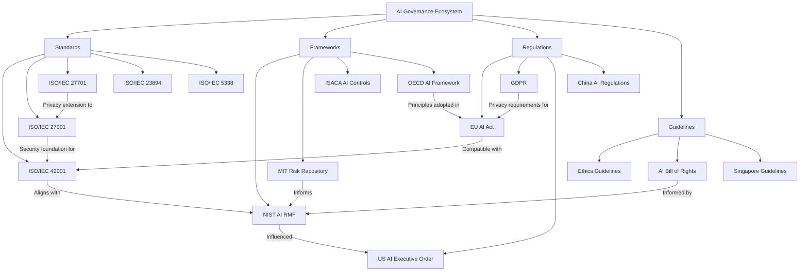
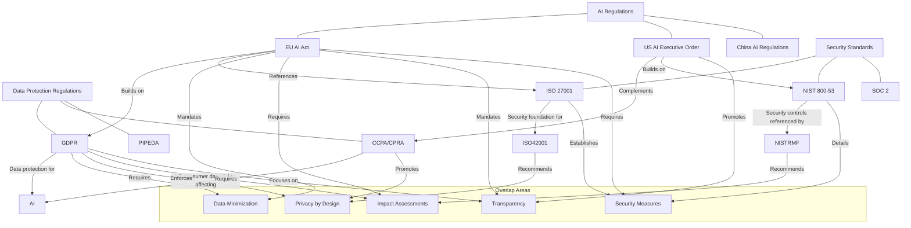
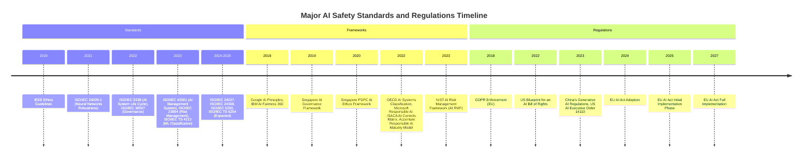

# Awesome Guide to AI Safety

A comprehensive collection of resources, frameworks, standards, regulations, and tools related to AI safety and governance. This repository also includes a [list of AI safety conferences](CONFERENCES.md) for networking and a [global map of AI regulations](AILAW.md) to track the evolving legal landscape.

## Table of Contents
- [Understanding AI Safety, Security, Assurance and Governance](#understanding-ai-safety-security-assurance-and-governance)
- [ISO Standards for AI Safety](#iso-standards-for-ai-safety)
- [AI Safety Tools](#ai-safety-tools)
  - [Open Source Tools](#open-source-tools)
  - [AI Security Tools](#ai-security-tools)
  - [Commercial Tools](#commercial-tools)
- [AI Risk Frameworks](#ai-risk-frameworks)
- [SANS Institute Critical AI Security Guidelines](#sans-institute-critical-ai-security-guidelines)
- [Threat Modeling Frameworks](#threat-modeling-frameworks)
- [AI Regulations](#ai-regulations)
- [OWASP Top 10 for LLM Applications](#owasp-top-10-for-llm-applications)
- [MITRE ATLAS Framework](#mitre-atlas-framework)
- [NIST Adversarial Machine Learning Taxonomy](#nist-adversarial-machine-learning-taxonomy)
- [AI Incident Sources](#ai-incident-sources)
- [National CERTs and Organizations Addressing AI Security](#national-certs-and-organizations-addressing-ai-security)
- [Framework Relationships](#framework-relationships)
- [Relationship to Other Regulations](#relationship-to-other-regulations)
- [Timeline of Standards and Regulations](#timeline-of-standards-and-regulations)
- [Essential Newsletters & Subscriptions](#essential-newsletters--subscriptions)
- [Essential Ted Talks](#essential-ted-talks)
- [Free AI Courses & Learning Resources](#free-ai-courses--learning-resources)
- [AI Governance Courses & Training](#ai-governance-courses--training)
- [Essential Books](#essential-books)
- [AI Governance Profession Report 2025](#ai-governance-profession-report-2025)
- [AI Agent Governance: A Field Guide](#ai-agent-governance-a-field-guide)
- [AI Safety Conferences](CONFERENCES.md)
- [Global AI Regulations and Legal Framework](AILAW.md)
- [AI Ethics Volunteering Opportunities](VOLUNTEER.md)

## Understanding AI Safety, Security, Assurance and Governance

### AI Ethics vs Responsible AI vs AI Safety

It's important to understand that AI Ethics, Responsible AI, and AI Safety are distinct concepts with different focuses, origins, and approaches:

#### AI Ethics
- **Origins**: The oldest of the three, emerging from philosophy in the 1940s with Norbert Wiener's "computer ethics"
- **Focus**: Reflective examination of what intelligent systems should do, how we define fairness, harm, or accountability
- **Key Question**: What's right?
- **Approach**: Academic, philosophical, focused on consequences and values

#### Responsible AI
- **Origins**: Newer concept that emerged around 2016, with Microsoft helping bring it into the mainstream
- **Focus**: Operational implementation of ethics into governance structures
- **Key Question**: How do we build ethical principles into systems?
- **Approach**: Policy development, tooling, review boards, compliance frameworks, making ethics scalable

#### AI Safety
- **Origins**: Developed with growing concerns about powerful AI systems, associated with thinkers like Nick Bostrom and Stuart Russell
- **Focus**: Control and alignment of AI systems to prevent unexpected or catastrophic outcomes
- **Key Question**: How do we ensure AI doesn't go off the rails?
- **Approach**: Technical safeguards, alignment research, existential risk mitigation, long-term oversight

While these concepts overlap, they address different questions with different tools and goals. All three perspectives are necessary for a comprehensive approach to trustworthy AI.

### AI Safety vs AI Security

Within the AI Safety domain, it's also important to distinguish between Safety and Security, as they focus on different aspects of AI system trustworthiness:

#### AI Safety
- **Primary Focus**: Preventing unintended harm from AI system behavior and outputs
- **Key Objectives**: 
  - Alignment with human values and ethical principles
  - System reliability and robustness
  - Prevention of unintended consequences
- **Risk Areas**: 
  - Algorithmic bias
  - Lack of transparency
  - Societal impact
  - Value misalignment

#### AI Security
- **Primary Focus**: Protecting AI systems from malicious threats
- **Key Objectives**: 
  - Confidentiality of AI systems and data
  - Integrity of models and outputs
  - Availability of AI services
- **Risk Areas**:
  - Data breaches
  - Model theft
  - Adversarial attacks
  - Infrastructure vulnerabilities

### AI Assurance

AI Assurance is the process of providing confidence in AI system trustworthiness through:

#### Key Components
1. **Measurement**: Evaluating AI system properties and behavior
2. **Evaluation**: Assessing against standards and requirements
3. **Communication**: Transparent reporting to stakeholders

#### Assurance Mechanisms
- Technical testing and validation
- Bias audits
- Conformity assessments
- Impact assessments
- Risk assessments
- Formal verification

### AI Governance

AI Governance provides the framework for ensuring responsible AI development and deployment:

#### Core Elements
1. **Policies and Standards**: Guidelines for AI development and use
2. **Risk Management**: Identifying and mitigating AI-related risks
3. **Accountability**: Clear roles and responsibilities
4. **Monitoring**: Continuous oversight of AI systems

#### Implementation Approach
- Risk-based assessment
- Cross-functional collaboration
- Regular auditing and review
- Stakeholder engagement
- Continuous improvement

### Google's Technical Approach to AGI Safety and Security

Google DeepMind's approach to technical Artificial General Intelligence (AGI) safety focuses on addressing risks that could lead to significant harm to humanity. Their framework identifies four key risk areas:

1. **Misuse**: Preventing malicious actors from accessing dangerous capabilities through:
   - Proactive identification of dangerous capabilities
   - Robust security measures and access restrictions
   - Comprehensive monitoring systems
   - Model safety mitigations

2. **Misalignment**: Employing a two-tier defense strategy:
   - **Model-level mitigations**: Amplified oversight and robust training for aligned models
   - **System-level security**: Monitoring and access control to mitigate harm from potentially misaligned models

3. **Mistakes**: Addressing errors in system deployment and operation

4. **Structural Risks**: Considering broader societal implications

This approach is complemented by techniques from interpretability, uncertainty estimation, and safer design patterns to enhance mitigation effectiveness.

The relationship between these four aspects is crucial:
- **Safety** ensures AI systems behave as intended
- **Security** protects against malicious threats
- **Assurance** provides evidence of trustworthiness
- **Governance** establishes the framework for responsible AI

Effective AI risk management requires addressing all these aspects throughout the AI system lifecycle, from design and development to deployment and monitoring.

## ISO Standards for AI Safety

| Standard | Title | Description | Status |
|----------|-------|-------------|--------|
| ISO/IEC 42001 | Information technology — Artificial intelligence — Management system | Provides requirements for an AI management system, focusing on responsible development and use of AI | Published 2023 |
| ISO/IEC TS 4213 | Assessment of machine learning classification performance | Provides a methodology for assessment of ML classification performance | Published 2023 |
| ISO/IEC 23894 | AI Risk Management | Guidance on managing risks to organizations related to AI systems | Published 2023 |
| ISO/IEC 24027 | Bias in AI systems and AI aided decision making | Guidelines addressing bias in AI systems | Under development |
| ISO/IEC 24029 | Assessment of the robustness of neural networks | Guidelines for neural network robustness assessment | Part 1 published 2021 |
| ISO/IEC 24368 | AI governance implications of using AI systems | Guidance on AI governance | Under development |
| ISO/IEC 5259 | Data quality for analytics and ML | Guidelines for data quality | Multiple parts under development |
| ISO/IEC 25059 | Quality evaluation of learning capabilities in AI systems | Guidance on evaluating AI system quality | Under development |
| ISO/IEC 38507 | Governance implications of the use of AI by organizations | Provides guidance for governing bodies on AI use | Published 2022 |
| ISO/IEC 5338 | AI system life cycle processes | Framework for AI system life cycle processes | Published 2022 |
| ISO/IEC TS 6254 | Objectives and methods for explainability of ML models | Technical specification for ML explainability | Under development |

## AI Safety Tools

See the detailed [AI Safety Tools and OWASP LLM Top 10 Mapping](TOOLS.md) for a comprehensive comparison of open source, commercial, and security tools, including their coverage of the OWASP Top 10 for LLM Applications.

### Open Source Tools

| Tool | Category | Description | Link |
|------|----------|-------------|------|
| AI Fairness 360 | Fairness | Toolkit to help detect and mitigate bias in ML models | [GitHub](https://github.com/Trusted-AI/AIF360) |
| EthicalML | Ethics | Open-source tools for ethical machine learning | [GitHub](https://github.com/EthicalML) |
| InterpretML | Explainability | Toolkit for model interpretability | [GitHub](https://github.com/interpretml/interpret) |
| LIME | Explainability | Tool for explaining predictions of ML models | [GitHub](https://github.com/marcotcr/lime) |
| SHAP | Explainability | Tool to explain outputs of any ML model | [GitHub](https://github.com/slundberg/shap) |
| ML Privacy Meter | Privacy | Tool to quantify privacy risks in ML models | [GitHub](https://github.com/privacytrustlab/ml_privacy_meter) |
| Privacy-Enhancing Technologies (PETs) | Privacy | Suite of technologies for operationalizing privacy in AI systems | See PET section below |
| MLflow | ML Lifecycle | Platform for managing ML lifecycle | [GitHub](https://github.com/mlflow/mlflow) |
| Model Cards Toolkit | Documentation | Tool for creating model cards | [GitHub](https://github.com/tensorflow/model-card-toolkit) |

### AI Security Tools

#### Open Source

| Tool | Category | Description | Link |
|------|----------|-------------|------|
| Adversarial Robustness Toolbox | Security | Comprehensive library for building AI systems that are secure against adversarial threats, developed by IBM Research | [GitHub](https://github.com/Trusted-AI/adversarial-robustness-toolbox) |
| Foolbox | Neural Network Security | Framework for creating and evaluating adversarial examples that fool neural networks, supporting multiple ML frameworks | [GitHub](https://github.com/bethgelab/foolbox) |
| Garak | LLM Security | Comprehensive LLM vulnerability scanner by NVIDIA that detects prompt injection, jailbreaking, data extraction, and other LLM-specific attacks | [GitHub](https://github.com/NVIDIA/garak) |
| Mindgard | AI Application Security | End-to-end framework for testing and securing AI applications against prompt injection, data poisoning, and model extraction | [GitHub](https://github.com/mindgard) |
| NOVA Framework | Prompt Analysis | Open-source prompt pattern matching system combining keyword detection, semantic similarity, and LLM-based evaluation to analyze and detect prompt content | [GitHub](https://github.com/fr0gger/nova-framework) |
| CSA AI Matrix | Security Controls | Cloud Security Alliance's comprehensive framework mapping security controls to AI risks across development and deployment stages | [GitHub](https://cloudsecurityalliance.org/artifacts/ai-security-framework) |
| AI Verify | Testing Framework | World's first AI Governance Testing Framework aligned with international standards (EU, OECD, Singapore) for validating AI systems across transparency, explainability, fairness, and safety | [Website](https://aiverifyfoundation.sg/what-is-ai-verify/) |
| Project Moonshot | LLM Testing | Open-source LLM Evaluation Toolkit for benchmarking, red teaming, and testing baselines to help manage LLM deployment risks | [GitHub](https://github.com/aiverify-foundation/moonshot) |

### Commercial Tools

| Tool | Category | Description | Link |
|------|----------|-------------|------|
| IBM Watson OpenScale | Fairness/Monitoring | AI bias detection and fairness monitoring | [IBM](https://www.ibm.com/products/watson-openscale) |
| Microsoft Azure Responsible AI | Comprehensive | Suite of tools for responsible AI | [Microsoft](https://azure.microsoft.com/en-us/solutions/responsible-ai/) |
| Google Cloud AI | Comprehensive | AI platform with responsible AI features | [Google](https://cloud.google.com/vertex-ai) |

### Privacy-Enhancing Technologies for AI

Privacy-Enhancing Technologies (PETs) provide critical mechanisms to protect privacy while enabling data use in AI systems. Key PETs applicable to AI include:

| Technology | Description | Application in AI |
|------------|-------------|------------------|
| Synthetic Data | Artificially generated data that preserves statistical properties without exposing real personal information | Training data generation, testing AI systems |
| Homomorphic Encryption | Enables computation on encrypted data without decryption | Secure cross-border data sharing, confidential model training |
| Differential Privacy | Mathematical framework that adds noise to data or queries to protect individual privacy | Training data protection, privacy-preserving analytics |
| Federated Learning | Trains AI models across multiple devices or servers without exchanging the underlying data | Distributed model training while keeping data local |
| Trusted Execution Environments | Secure hardware-based isolated execution environments | Protecting sensitive computations and data processing |
| Secure Multi-Party Computation | Allows multiple parties to jointly compute a function over inputs while keeping those inputs private | Collaborative AI model development across organizations |

These technologies help operationalize privacy by design and default in AI systems, addressing both legal compliance requirements and ethical considerations while enabling beneficial data sharing and use.

### Assessment Templates and Frameworks

| Template/Framework | Organization | Description | Link |
|-------------------|--------------|-------------|------|
| Responsible AI Impact Assessment Template | Microsoft | A multi-year effort to define a process for assessing the impact an AI system may have on people, organizations, and society | [Microsoft](https://blogs.microsoft.com/wp-content/uploads/prod/sites/5/2022/06/Microsoft-RAI-Impact-Assessment-Template.pdf) |
| SAIF Risk Assessment Tool | Google | A questionnaire-based tool that generates an instant and tailored checklist to guide practitioners to secure their AI systems | [Google](https://saif.google/secure-ai-framework) |
| AI Assessment Framework | Digital NSW | Framework to guide NSW Government agencies through the ethical development, deployment and use of AI technologies | [Digital NSW](https://www.digital.nsw.gov.au/policy/artificial-intelligence/nsw-artificial-intelligence-assessment-framework) |
| Foundational AI Risk Assessment (FAIRA) | QLD Government | A transparency, accountability, and risk identification tool for Queensland Government agencies evaluating AI solutions | [QLD Government](https://www.forgov.qld.gov.au/information-and-communication-technology/qgea-directions-and-guidance/qgea-policies-standards-and-guidelines/foundational-artificial-intelligence-risk-assessment-guideline) |
| AI Risk Assessment Template for NIST AI RMF | TrustArc | A structured framework designed to systematically identify, evaluate, and mitigate potential risks associated with AI | [TrustArc](https://trustarc.com/resource/ai-risk-assessment/) |
| Algorithmic Impact Assessment Tool | Government of Canada | A questionnaire designed to help assess and mitigate the impacts associated with deploying an automated decision system | [Government of Canada](https://www.canada.ca/en/government/system/digital-government/digital-government-innovations/responsible-use-ai/algorithmic-impact-assessment.html) |
| Generative AI Vendor Evaluation Tool | FSISAC | A tool designed to help organizations assess and select generative AI vendors while managing associated risks | [FSISAC](https://www.fsisac.com/hubfs/Knowledge/AI/FSISAC_GenerativeAI-VendorEvaluation&QualitativeRiskAssessment.pdf) |
| AI Management Essentials Tool (AIME) | UK Department for Science, Innovation and Technology (DSIT) | A self-assessment questionnaire to help organizations assess and improve their AI governance and management processes, aligned with ISO/IEC 42001, NIST AI RMF, and EU AI Act | [AIME Tool](documents/The%20AIME%20tool.pdf) |

### Additional Commercial Tools

| Tool | Category | Description | Link |
|------|----------|-------------|------|
| Dataiku | ML Operations | Platform for data science and ML operations | [Dataiku](https://www.dataiku.com/) |
| Arthur AI | Monitoring | ML model monitoring platform | [Arthur](https://www.arthur.ai/) |
| Fiddler AI | Explainability/Monitoring | ML monitoring and explainability platform | [Fiddler](https://www.fiddler.ai/) |
| Credo AI | Governance | AI governance platform | [Credo AI](https://www.credo.ai/) |
| DotData | AutoML | Automated ML platform with governance features | [DotData](https://dotdata.com/) |
| Weights & Biases | Experiment Tracking | ML experiment tracking tool | [W&B](https://wandb.ai/) |
| Determined AI | Training Platform | ML training platform | [Determined AI](https://www.determined.ai/) |

#### Commercial

| Tool | Category | Description | Link |
|------|----------|-------------|------|
| Lakera | LLM Security | AI security platform that protects against prompt injections, jailbreaks, and other LLM-specific vulnerabilities with continuous monitoring | [Lakera](https://www.lakera.ai/) |
| Vijil AI | AI Security Monitoring | Comprehensive AI security platform that monitors AI systems for vulnerabilities, unauthorized access, and data leakage in real-time | [Vijil](https://www.vijil.ai/) |
| Robust Intelligence | AI Security Platform | End-to-end platform for testing, monitoring, and securing AI systems against adversarial attacks, data drift, and model failures | [Robust Intelligence](https://www.robustintelligence.com/) |

## AI Risk Frameworks

### IBM's Approach to AI Agent Risks and Mitigations

IBM's AI Ethics Board has developed a framework for understanding opportunities, risks, and mitigations related to AI agents (software entities that use AI techniques and have agency to act on goals). Key aspects include:

#### AI Agent Characteristics and Risk Factors
- **Opaqueness**: Limited visibility into AI agent operations and interactions
- **Open-endedness**: Flexibility in selecting resources/tools/other agents that may lead to unexpected actions
- **Complexity**: Emerges as a consequence of open-endedness and compounds with scaling
- **Non-reversibility**: Consequences of actions that impact the world may be difficult to reverse

#### Benefits of AI Agents
- Augmenting human intelligence
- Automation of routine tasks
- Improved efficiency and productivity
- Enhanced decision-making and response quality

#### Risk Mitigation Approaches
- Sociotechnical methods including software tools
- Risk assessment processes
- AI ethics frameworks
- Governance mechanisms
- Multistakeholder consultations
- Standards and regulation

This framework acknowledges that AI agents, while providing significant benefits, require comprehensive risk management approaches that address both technical and societal considerations.

| Framework | Organization | Description | Release Date |
|-----------|--------------|-------------|--------------|
| AI Risk Management Framework (AI RMF) | NIST | Comprehensive framework for identifying, assessing, and managing AI risks | January 2023 |
| AI Risk Repository | MIT | Repository of over 1,000 AI risks with structured taxonomies | Ongoing |
| OECD Framework for the Classification of AI Systems | OECD | Classification system for AI systems based on risk levels | February 2022 |
| Responsible AI Framework | Microsoft | Framework for responsible AI development and deployment | 2022 |
| Artificial Intelligence Risk & Controls Matrix | ISACA | Matrix for evaluating AI risks and controls | 2022 |
| AI Ethics Guidelines | IEEE | Guidelines for ethical AI development | 2019 |
| Responsible AI Maturity Model | Accenture | Framework to assess and improve responsible AI practices | 2022 |
| AI Principles | Google | Principles and practices for responsible AI | 2018 |
| AI Ethics Framework | Singapore PDPC | Guidelines for ethical use of AI | 2020 |
| AI Fairness 360 | IBM | Toolkit and framework for fairness in AI | 2018 |

- **MIT AI Risk Repository (April 2025 Update):**
  - The MIT AI Risk Repository is a comprehensive, regularly updated database of AI risks, frameworks, and taxonomies, supporting research, standards, and risk management.
  - The April 2025 update added 9 new frameworks, ~600 new risks, and a new subdomain on multi-agent risks. Notable additions include:
    - International Scientific Report on the Safety of Advanced AI
    - Collaborative taxonomy of AI, algorithmic, and automation harms
    - Multi-Agent Risks from Advanced AI
    - Taxonomy of systemic risks from general-purpose AI
    - AI Risk Atlas
    - Generative AI misuse taxonomy
    - Risk sources and management for general-purpose AI
    - AI Hazard Management framework
    - AILUMINATE AI Risk and Reliability Benchmark
  - Access the repository at [airisk.mit.edu](https://airisk.mit.edu) or see the local summary: [April 2025 update of the AI Risk Repository.pdf](documents/April%202025%20update%20of%20the%20AI%20Risk%20Repository.pdf)

## SANS Institute Critical AI Security Guidelines

The SANS Institute has developed comprehensive security guidelines for AI implementations, focusing on six critical control categories. These guidelines provide actionable recommendations for organizations implementing AI systems, particularly generative AI.

### Control Categories

#### 1. Access Controls
- **Protect Model Parameters**: Implement least privilege principles and strong access controls
- **Secure Vector Databases**: Apply proper authentication and authorization for vector database access
- **Encryption**: Use encryption for model files at rest and runtime obfuscation
- **Trusted Execution Environments (TEEs)**: Consider using TEEs to reduce risk of unauthorized access

#### 2. Data Protection
- **Protect Training Data**: Implement controls to prevent data poisoning
- **Manage Context Windows**: Control what data enters the context window
- **Prevent Data Leakage**: Implement measures to prevent sensitive data exposure
- **Secure Data Pipelines**: Protect the entire data pipeline from collection to inference

#### 3. Deployment Strategies
- **Secure API Endpoints**: Protect internal training and inference API endpoints
- **Implement Rate Limiting**: Prevent denial-of-service attacks
- **Secure Model Deployment**: Ensure secure deployment pipelines
- **Consider Deployment Architecture**: Evaluate on-premises vs. cloud deployment security implications

#### 4. Inference Security
- **Input Validation**: Implement strict validation for all inputs
- **Output Filtering**: Filter outputs to prevent sensitive information disclosure
- **Prevent Prompt Injection**: Guard against prompt injection attacks
- **Implement Multilayered Protection**: Don't rely solely on system prompts for security

#### 5. Monitoring
- **Track Inference Refusals**: Measure and track when inference is refused
- **Log Prompts**: Log prompts and outputs for sensitive workloads
- **Continuous Monitoring**: Implement monitoring for issues and misuse
- **Protect Audit Logs**: Secure logs that may contain sensitive data

#### 6. Governance, Risk, Compliance (GRC)
- **Maintain AI Bill-of-Materials (AIBOM)**: Track AI supply chain components
- **Use Model Registries**: Implement centralized repositories to track and manage ML models
- **Regular Testing**: Test and tune LLM applications/models regularly
- **Establish AI GRC Board**: Incorporate AI usage into existing GRC frameworks

### Key Recommendations

- **Multilayered Protection**: Don't rely solely on system prompts; implement multiple security layers
- **Risk-Based Approach**: Use risk-based approaches when implementing AI
- **Continuous Testing**: Regularly test AI systems for security vulnerabilities
- **Regulatory Compliance**: Stay informed about evolving AI regulations

These guidelines represent point-in-time security recommendations in a rapidly evolving field. Organizations should adapt these controls to their specific AI implementations and risk profiles.

## Threat Modeling Frameworks

| Framework | Description | Suitability for AI Safety, Governance, and Trustworthiness |
|-----------|-------------|-------------------------------------------------------|
| STRIDE | Developed by Microsoft, categorizes threats into six types: Spoofing, Tampering, Repudiation, Information disclosure, Denial of service, and Elevation of privilege. | Moderately suitable for AI systems. While effective for technical security concerns, it doesn't inherently address AI-specific issues like algorithmic bias or ethical considerations. Can be adapted for AI by extending the categories. |
| LINDDUN | Focuses on privacy concerns, categorizing threats as Linkability, Identifiability, Non-repudiation, Detectability, Disclosure of information, Unawareness, and Non-compliance. | Well-suited for addressing privacy concerns in AI systems. Particularly valuable for AI applications handling personal data, but needs extension to cover other AI-specific risks. |
| DREAD | Risk assessment model evaluating threats based on Damage potential, Reproducibility, Exploitability, Affected users, and Discoverability. | Generally applicable but less comprehensive for AI-specific concerns. Helpful for prioritizing identified risks but should be combined with AI-specific threat categories. |
| PASTA | Process for Attack Simulation and Threat Analysis - A risk-centric methodology integrating business objectives with technical requirements. | Good for enterprise AI deployments due to its business focus. Helps align AI risk management with business objectives, but requires additional AI-specific threat patterns. |
| OCTAVE | Operationally Critical Threat, Asset, and Vulnerability Evaluation - A risk-based strategic assessment framework focusing on organizational risk management. | Well-suited for organizational AI governance due to its focus on strategic risk management. Particularly valuable for mapping organizational risk to AI applications. |
| ATT&CK for ML | MITRE's extension of the ATT&CK framework specifically for machine learning systems, categorizing tactics and techniques for attacking ML systems. | Highly suitable for AI security, as it's specifically designed for ML systems. Focuses on technical attack vectors against ML models but less coverage of broader governance and ethical issues. |
| FAIR | Factor Analysis of Information Risk - A quantitative model for information security and operational risk assessment. | Strong for quantifying AI risks and economic impact. Valuable for organizations needing to measure AI risk in financial terms but needs customization for AI-specific threats. |
| AI-specific Threat Modeling | Microsoft's Failure Modes in Machine Learning - Framework specifically for ML systems, covering attacks, failures, and vulnerabilities specific to ML. | Highly suitable as it was designed specifically for ML systems. Covers both intentional attacks and unintentional failures specific to AI. |
| NIST AI RMF | A comprehensive framework addressing the full lifecycle of AI risk management. | Excellent for AI governance and trustworthiness. The most comprehensive framework for addressing AI risks across technical, ethical, and governance dimensions. Strongly recommended for organizations seeking a holistic approach. |
| RVST | AI Verify Foundation's Resilience, Vulnerability, Safety, and Trustworthiness - A systematic approach to identifying AI vulnerabilities and potential harms. | Excellent for AI safety and trustworthiness. Designed specifically to address AI-specific concerns including social impact, bias, and reliability. |

### Framework Recommendations

- **For AI Safety:** NIST AI RMF and AI Verify's RVST provide the most comprehensive coverage of safety concerns, including unintended consequences and alignment issues.

- **For AI Governance:** OCTAVE and NIST AI RMF offer strong organizational governance approaches, helping connect AI risks to business processes and compliance requirements.

- **For AI Trustworthiness:** NIST AI RMF and LINDDUN combine well to address both technical trustworthiness and privacy concerns that impact user trust.

- **For a Combined Approach:** Organizations should consider using NIST AI RMF as a base framework, supplemented with ATT&CK for ML for technical security threats and LINDDUN for detailed privacy analysis.

## AI Regulations

| Regulation | Jurisdiction | Description | Status | Effective Date |
|------------|--------------|-------------|--------|---------------|
| EU AI Act | European Union | Comprehensive regulation of AI systems based on risk levels | Approved | Phased implementation 2024-2027 |
| GDPR (AI provisions) | European Union | Data protection regulation with AI implications | Enforced | May 2018 |
| AI Executive Order (14110) | United States | Orders for development of AI with safety, security, and trust | Issued | October 2023 |
| AI Risk Management Framework (AI RMF) | United States | Voluntary framework for managing AI risks | Released | January 2023 |
| Blueprint for an AI Bill of Rights | United States | Guidelines for protecting rights in AI systems | Released | October 2022 |
| Algorithmic Accountability Act | United States | Proposed legislation for impact assessments | Proposed | - |
| China's Generative AI Regulations | China | Regulations for generative AI models | Effective | August 2023 |
| PCPD Guidelines for Employees on AI | Hong Kong | Guidelines for employees on responsible AI use in the workplace | Published | March 2025 |
| Artificial Intelligence and Data Act (AIDA) | Canada | Proposed legislation for regulating AI | Proposed | - |
| Algorithm Act | South Korea | Regulates algorithmic recommendation systems | Proposed | - |
| AI Governance Framework | Singapore | Guidelines for responsible AI deployment | Released | 2019 |

### AI Compliance Resources

| Resource | Organization | Description | Publication Date |
|----------|--------------|-------------|------------------|
| Navigating AI Compliance, Part 1 | Institute of Science and Technology | Comprehensive guide on AI compliance frameworks and regulatory requirements | 2023 |
| Navigating Risk Compliance, Part 2 | Institute of Science and Technology | Detailed analysis of AI risk assessment and compliance implementation strategies | 2023 |

The [Institute of Science and Technology](https://istonline.org.uk/) has published valuable resources on AI compliance that provide organizations with practical guidance on navigating the complex landscape of AI regulations and risk management.

## OWASP Top 10 for LLM Applications

The OWASP Top 10 for LLM Applications provides a standardized awareness document for developers and security professionals about the most critical security risks to Large Language Model (LLM) applications. This list is updated regularly to reflect the evolving threat landscape of generative AI systems.

### OWASP GenAI Top 10 (2023-2024)

| Risk ID | Risk Name | Description | Key Mitigations |
|---------|-----------|-------------|----------------|
| LLM01 | Prompt Injection | Attackers manipulate LLMs through crafted inputs that override intended instructions or controls | Input validation, prompt hardening, context window sanitization |
| LLM02 | Insecure Output Handling | Insufficient validation of LLM outputs leading to vulnerabilities like XSS, SSRF, etc. | Output filtering, content security policies, sandboxed rendering |
| LLM03 | Training Data Poisoning | Manipulation of training data to introduce vulnerabilities or biases | Data provenance tracking, anomaly detection, dataset security |
| LLM04 | Model Denial of Service | Crafting inputs that cause excessive resource consumption | Rate limiting, resource quotas, monitoring for anomalous behavior |
| LLM05 | Supply Chain Vulnerabilities | Weaknesses in the LLM development/deployment pipeline | Vendor security assessment, model verification, integrity controls |
| LLM06 | Sensitive Information Disclosure | LLMs revealing confidential data from training or user interactions | Data minimization, PII detection, output filtering |
| LLM07 | Insecure Plugin Design | Security flaws in plugins or extensions that enhance LLM functionality | Least privilege principles, API security, input/output validation |
| LLM08 | Excessive Agency | Granting LLMs too much autonomy to perform actions | Explicit user confirmation, guardrails, limited action scope |
| LLM09 | Overreliance | Excessive trust in LLM outputs without verification | Human oversight, confidence scoring, cross-validation |
| LLM10 | Model Theft | Unauthorized access or extraction of proprietary models | Access controls, API rate limiting, watermarking |

### Mapping OWASP GenAI Top 10 to Other Frameworks and Standards

| OWASP Risk | ISO/IEC Standards | NIST AI RMF | EU AI Act Implications |
|------------|------------------|-------------|----------------------|
| LLM01: Prompt Injection | ISO/IEC 42001 (Governance), ISO/IEC 27001 (Security) | Govern 1.2, Govern 1.4, Map 1.3 | High-risk system requirements, Art. 9 |
| LLM02: Insecure Output Handling | ISO/IEC 5259 (Data quality), ISO/IEC 27001 | Map 1.3, Measure 2.2 | Transparency obligations, Art. 13 |
| LLM03: Training Data Poisoning | ISO/IEC 42001, ISO/IEC 5259, ISO/IEC 25059 | Map 2.2, Map 2.3, Map 2.4 | Data governance provisions, Art. 10 |
| LLM04: Model Denial of Service | ISO/IEC 27001, ISO/IEC TR 5469 | Measure 1.4, Manage 2.3 | Technical robustness, Art. 15 |
| LLM05: Supply Chain Vulnerabilities | ISO/IEC 42001, ISO/IEC 27001, ISO/IEC 5338 | Govern 2.3, Map 1.4 | Risk management systems, Art. 9 |
| LLM06: Sensitive Information Disclosure | ISO/IEC 27001, ISO/IEC 29134 (PIA) | Map 2.1, Measure 3.2, Manage 1.2 | Data minimization, Art. 10, GDPR alignment |
| LLM07: Insecure Plugin Design | ISO/IEC 27001, ISO/IEC 5338 | Govern 3.3, Measure 1.4 | Integration security, Art. 15 |
| LLM08: Excessive Agency | ISO/IEC 23894 (Risk Management) | Govern 1.5, Manage 3.1 | Human oversight provisions, Art. 14 |
| LLM09: Overreliance | ISO/IEC 23894, ISO/IEC 42001 | Measure 2.1, Manage 3.2 | Accuracy requirements, Art. 15 |
| LLM10: Model Theft | ISO/IEC 27001, ISO/IEC 24028 | Govern 3.2, Manage 1.4 | Technical robustness, Art. 15 |

### Benefits of OWASP Integration with ISO Standards and Regulatory Frameworks

1. **Comprehensive Security Coverage**: Using OWASP GenAI Top 10 alongside ISO standards provides both security-specific guidance and broader governance frameworks.

2. **Regulatory Alignment**: Mapping OWASP risks to regulatory requirements (e.g., EU AI Act) helps organizations proactively address compliance needs.

3. **Risk-Based Prioritization**: The OWASP risk ranking helps organizations prioritize their security efforts within the broader context of standards implementation.

4. **Implementation Guidance**: OWASP provides specific technical mitigations that complement the more process-oriented approaches in ISO standards.

5. **Security by Design**: Integrating OWASP considerations during the early stages of AI system development aligns with ISO/IEC 42001's emphasis on proper governance throughout the AI lifecycle.

## MITRE ATLAS Framework

The MITRE Adversarial Threat Landscape for Artificial-Intelligence Systems (ATLAS) framework provides a comprehensive knowledge base for understanding and mitigating adversarial threats to AI systems. Modeled after the widely-used MITRE ATT&CK framework, ATLAS maps out tactics, techniques, and procedures (TTPs) specific to attacks against machine learning systems.

### Core Components of MITRE ATLAS

| Component | Description | Examples |
|-----------|-------------|----------|
| Tactics | High-level adversarial goals | Reconnaissance, ML Supply Chain Compromise, Model Evasion |
| Techniques | Specific methods to achieve these goals | Data Poisoning, Model Inversion, Adversarial Examples |
| Case Studies | Real-world examples of AI attacks | Documented incidents of ML system compromises |
| Mitigations | Countermeasures to prevent or detect attacks | Adversarial Training, Input Validation, Model Monitoring |

### ATLAS Tactics and Techniques

| Tactic | Description | Key Techniques |
|--------|-------------|---------------|
| Reconnaissance | Gathering information about ML systems | ML Model Probing, ML Architecture Reconnaissance |
| Resource Development | Establishing resources to support operations | Acquire ML Infrastructure, Develop ML Capabilities |
| Initial Access | Gaining initial access to ML systems | Supply Chain Compromise, Social Engineering |
| ML Supply Chain Compromise | Attacking the ML development pipeline | Data Poisoning, Algorithm Poisoning, Malicious ML Components |
| ML Model Access | Accessing an ML model or its artifacts | Model Theft, Credential Access, API Abuse |
| Execution | Running adversarial code or manipulating ML execution | Code Injection, Prompt Injection, Input Manipulation |
| Collection | Gathering sensitive data from ML systems | Output Filtering, Model Inversion, Data Extraction |
| Exfiltration | Stealing model artifacts or sensitive data | Unauthorized Data Transfer, Model Extraction |
| Impact | Directly affecting ML availability, integrity, or confidentiality | DoS Attack, Model Corruption, Output Manipulation |
| Model Evasion | Bypassing ML detection systems | Adversarial Examples, Input Filtering Evasion, Feature Manipulation |
| Inference | Extracting information about the model or training data | Membership Inference, Property Inference, Training Data Extraction |

### Mapping MITRE ATLAS to ISO Standards and Risk Frameworks

| ATLAS Component | ISO/IEC Standards | AI Risk Frameworks | Implementation Considerations |
|-----------------|-------------------|-------------------|------------------------------|
| Reconnaissance Defense | ISO/IEC 27001 (Information Security), ISO/IEC 42001 (AI Management) | NIST AI RMF (Govern 2.3, Map 1.1) | Implement monitoring for ML system probing and reconnaissance |
| ML Supply Chain Security | ISO/IEC 5338 (AI Lifecycle), ISO/IEC 42001, ISO/IEC 27001 | NIST AI RMF (Map 2.3, Map A/B/C), ISACA AI Controls Matrix | Secure the entire ML development pipeline and verify data integrity |
| Model Access Controls | ISO/IEC 27001, ISO/IEC 24028 (AI Trustworthiness) | NIST AI RMF (Govern 3.2, Manage 1.4), Microsoft Responsible AI | Implement strict authentication, authorization, and auditing for model access |
| Adversarial Example Defense | ISO/IEC TR 24029 (AI Robustness), ISO/IEC 5469 (AI Functional Safety) | NIST AI RMF (Measure 1.1, Measure 1.4), Google AI Principles | Deploy adversarial training and input validation techniques |
| Model Evasion Prevention | ISO/IEC TR 24029, ISO/IEC 42001 | NIST AI RMF (Measure 2.2, Manage 1.2), Accenture Responsible AI Maturity | Implement detection mechanisms for adversarial inputs and model robustness testing |
| Inference Attack Mitigation | ISO/IEC 27001, ISO/IEC 29134 (Privacy) | NIST AI RMF (Measure 3.2, Manage 2.4), IBM AI Fairness 360 | Apply differential privacy and minimize unnecessary information disclosure |

### Benefits of Integrating MITRE ATLAS with Other Standards

1. **Comprehensive Threat Coverage**: ATLAS provides specific technical details about AI threats that complement the broader governance focus of ISO standards and risk frameworks.

2. **Security Testing Guidance**: ATLAS offers concrete examples and case studies that can be used to develop effective security testing methodologies aligned with ISO/IEC TR 24029 (Robustness assessment of neural networks).

3. **Defense-in-Depth Strategy**: Combining ATLAS with OWASP GenAI Top 10 creates a multi-layered defense approach, with ATLAS focusing on adversarial ML attacks and OWASP covering broader LLM application security.

4. **Supply Chain Security**: ATLAS's ML Supply Chain Compromise tactic aligns with ISO/IEC 5338 (AI system life cycle processes) to secure the entire AI development lifecycle.

5. **Risk Assessment Enhancement**: ATLAS case studies provide real-world examples to inform risk assessments required by ISO/IEC 23894 (AI Risk Management) and NIST AI RMF.

6. **Regulatory Compliance Support**: The detailed controls derived from ATLAS tactics help organizations meet the technical requirements of regulations like the EU AI Act, particularly for high-risk AI systems.

### Implementation Approach

Organizations can implement a unified security approach by mapping ATLAS tactics to their existing ISO-based management systems and risk frameworks:

1. Incorporate ATLAS threats into ISO/IEC 42001 risk assessments
2. Develop security controls based on ATLAS mitigations that satisfy ISO/IEC 27001 requirements
3. Use ATLAS case studies to inform threat modeling exercises required by NIST AI RMF
4. Align ATLAS defensive measures with EU AI Act technical documentation requirements
5. Implement continuous monitoring for ATLAS tactics using metrics defined in ISO/IEC 5338

### MITRE ATLAS and OWASP Relationships Diagram

```mermaid
graph TB
    classDef governance fill:#d4f1f9,stroke:#05a,stroke-width:1px
    classDef security fill:#ffe6cc,stroke:#d79b00,stroke-width:1px
    classDef regulation fill:#d5e8d4,stroke:#82b366,stroke-width:1px
    classDef relationship fill:none,stroke:#999,stroke-width:1px,stroke-dasharray: 5 5
    
    %% Main Nodes
    ATLAS[MITRE ATLAS]:::security
    OWASP[OWASP GenAI Top 10]:::security
    NIST[NIST AI RMF]:::governance
    ISO42001[ISO/IEC 42001]:::governance
    EUAI[EU AI Act]:::regulation
    
    %% ATLAS components
    ATLAS_RECON[Reconnaissance]:::security
    ATLAS_SUPPLY[ML Supply Chain]:::security
    ATLAS_EVASION[Model Evasion]:::security
    ATLAS_IMPACT[Impact]:::security
    
    %% OWASP components
    OWASP_PROMPT[LLM01: Prompt Injection]:::security
    OWASP_OUTPUT[LLM02: Insecure Output]:::security
    OWASP_POISON[LLM03: Training Data Poisoning]:::security
    OWASP_DOS[LLM04: Model DoS]:::security
    
    %% Framework components
    NIST_GOV[Govern]:::governance
    NIST_MAP[Map]:::governance
    NIST_MEASURE[Measure]:::governance
    NIST_MANAGE[Manage]:::governance
    
    ISO_RISK[Risk Management]:::governance
    ISO_LIFECYCLE[AI Lifecycle]:::governance
    
    EU_HIGHRISK[High-Risk Requirements]:::regulation
    EU_GENPURPOSE[General Purpose AI]:::regulation
    
    %% Main relationships
    ATLAS --> NIST
    OWASP --> NIST
    ATLAS --> ISO42001
    OWASP --> ISO42001
    ATLAS --> EUAI
    OWASP --> EUAI
    
    %% ATLAS breakdown
    ATLAS --> ATLAS_RECON
    ATLAS --> ATLAS_SUPPLY
    ATLAS --> ATLAS_EVASION
    ATLAS --> ATLAS_IMPACT
    
    %% OWASP breakdown
    OWASP --> OWASP_PROMPT
    OWASP --> OWASP_OUTPUT
    OWASP --> OWASP_POISON
    OWASP --> OWASP_DOS
    
    %% NIST breakdown
    NIST --> NIST_GOV
    NIST --> NIST_MAP
    NIST --> NIST_MEASURE
    NIST --> NIST_MANAGE
    
    %% ISO breakdown
    ISO42001 --> ISO_RISK
    ISO42001 --> ISO_LIFECYCLE
    
    %% EU AI Act breakdown
    EUAI --> EU_HIGHRISK
    EUAI --> EU_GENPURPOSE
    
    %% Cross-framework relationships
    ATLAS_SUPPLY -.->|Aligns with| OWASP_POISON
    ATLAS_IMPACT -.->|Relates to| OWASP_DOS
    ATLAS_EVASION -.->|Complements| OWASP_PROMPT
    
    ATLAS_RECON -.->|Informs| NIST_MAP
    ATLAS_SUPPLY -.->|Supports| NIST_GOVERN
    OWASP_PROMPT -.->|Addresses| NIST_MANAGE
    OWASP_OUTPUT -.->|Measured by| NIST_MEASURE
    
    ATLAS_SUPPLY -.->|Required by| ISO_LIFECYCLE
    OWASP_POISON -.->|Managed in| ISO_RISK
    
    ATLAS_EVASION -.->|Compliance for| EU_HIGHRISK
    OWASP_OUTPUT -.->|Required for| EU_GENPURPOSE
    
    %% Labels
    subgraph SecurityFrameworks ["Security Frameworks"]
        ATLAS
        OWASP
    end
    
    subgraph GovernanceStandards ["Governance Standards"]
        NIST
        ISO42001
    end
    
    subgraph Regulations ["Regulations"]
        EUAI
    end
```

## NIST Adversarial Machine Learning Taxonomy

The National Institute of Standards and Technology (NIST) has published a comprehensive taxonomy and terminology framework for adversarial machine learning (AML) that complements the MITRE ATLAS framework. This publication (NIST AI 100-2) provides a structured approach to understanding and addressing security threats to AI systems.

### Key Components of NIST AI 100-2

| Component | Description |
|-----------|-------------|
| Attack Classification | Hierarchical taxonomy of attacks categorized by stages of learning, attacker goals, capabilities, and knowledge |
| Predictive AI Attacks | Structured taxonomy with unique identifiers (e.g., NISTAML.01 for Availability Violations) |
| Generative AI Attacks | Specific taxonomy elements addressing unique vulnerabilities in generative AI systems |
| Mitigation Strategies | Corresponding countermeasures for each attack category |

### Predictive AI Attack Categories

| Attack Category | ID | Description | Examples |
|-----------------|-------|-------------|----------|
| Availability Violations | NISTAML.01 | Attacks that degrade model performance or cause denial of service | Model poisoning, data poisoning, energy-latency attacks |
| Integrity Violations | NISTAML.02 | Attacks that cause incorrect model behavior or outputs | Evasion attacks, backdoor poisoning, targeted poisoning |
| Privacy Compromises | NISTAML.03 | Attacks that extract sensitive information | Model extraction, reconstruction, membership inference |
| Supply Chain Attacks | NISTAML.05 | Attacks targeting the AI development pipeline | Model poisoning during development or distribution |

### Generative AI Attack Categories

The taxonomy also addresses unique vulnerabilities in generative AI systems, including:

- Prompt injection attacks
- Training data extraction
- Jailbreaking techniques
- Output manipulation

### Integration with Security Frameworks

The NIST taxonomy is designed to integrate with existing security frameworks and standards:

- Complements the MITRE ATLAS framework with standardized terminology
- Aligns with the NIST AI Risk Management Framework (AI RMF)
- Provides a common language for security practitioners and AI developers
- Establishes a foundation for future standards and practice guides

This taxonomy serves as an essential resource for organizations seeking to implement comprehensive security measures for their AI systems, providing a structured approach to identifying, categorizing, and mitigating adversarial threats.

*Source: [NIST AI 100-2e2025: Adversarial Machine Learning: A Taxonomy and Terminology of Attacks and Mitigations](https://csrc.nist.gov/pubs/ai/100/2/e2025/final) (March 2025)*

## AI Incident Sources

| Source | Organization | Description | Link |
|--------|--------------|-------------|------|
| AI Incident Database | AIID | Repository of AI incidents and issues | [AIID](https://incidentdatabase.ai/) |
| AI Incidents Database | MIT | Database tracking AI incidents with risk taxonomy | [MIT](https://www.aiincidentdatabase.com/) |
| XRSI AI Incident Register | XRSI | Reports of privacy violations and harms from AI | [XRSI](https://xrsi.org/the-xrsi-ai-incident-register) |
| AI Vulnerabilities Database | AVID | Database of ML vulnerabilities | [AVID](https://avidml.org/) |
| Responsible AI Tracker | Montreal AI Ethics Institute | Tracking AI ethics incidents and developments | [MAIEI](https://montrealethics.ai/) |
| AI Ethics Incidents | ParthLabs | Collection of AI ethics incidents | [ParthLabs](https://parthlabs.github.io/ai_ethics_incidents/) |
| Algorithm Watch | Algorithm Watch | Monitoring AI systems and their impacts | [Algorithm Watch](https://algorithmwatch.org/) |
| AI Alignment Map | AI Alignment | Mapping AI alignment research and incidents | [Alignment Map](https://www.alignmentmap.org/) |
| AI Safety Gridworlds | DeepMind | Testing environments for AI safety | [GitHub](https://github.com/deepmind/ai-safety-gridworlds) |
| AI Testing Toolkit | Anthropic | Tools for testing AI safety | [Anthropic](https://www.anthropic.com/research) |

## National CERTs and Organizations Addressing AI Security

| Organization | Country/Region | AI Security Focus | Link |
|--------------|----------------|------------------|------|
| Cybersecurity and Infrastructure Security Agency (CISA) | United States | AI security guidance, vulnerability reporting, and incident response | [CISA AI](https://www.cisa.gov/ai) |
| CERT Coordination Center (CERT/CC) | United States | Vulnerability coordination and AI security research | [CERT/CC](https://www.sei.cmu.edu/about/divisions/cert/index.cfm) |
| National Cyber Security Centre (NCSC) | United Kingdom | AI security guidelines and incident reporting | [NCSC AI](https://www.ncsc.gov.uk/collection/ai) |
| Australian Cyber Security Centre (ACSC) | Australia | AI security guidance and incident response | [ACSC](https://www.cyber.gov.au/) |
| Japan Computer Emergency Response Team (JPCERT/CC) | Japan | AI vulnerability coordination and security alerts | [JPCERT/CC](https://www.jpcert.or.jp/english/) |
| BSI National Cyber Security Centre | Germany | AI security standards and incident reporting | [BSI](https://www.bsi.bund.de/EN/Themen/Unternehmen-und-Organisationen/Informationen-und-Empfehlungen/Kuenstliche_Intelligenz_KI/kuenstliche_intelligenz_node.html) |
| Canadian Centre for Cyber Security (CCCS) | Canada | AI security guidance and vulnerability management | [CCCS](https://cyber.gc.ca/en/) |
| Singapore Computer Emergency Response Team (SingCERT) | Singapore | AI system vulnerability coordination | [SingCERT](https://www.csa.gov.sg/singcert) |
| Thailand Computer Emergency Response Team (ThaiCERT) | Thailand | AI security trends and incident monitoring | [ThaiCERT](https://www.thaicert.or.th/en/) |
| Korea Internet & Security Agency (KISA) | South Korea | AI security research and incident response | [KISA](https://www.kisa.or.kr/eng/) |
| CERT-EU | European Union | AI security coordination for EU institutions | [CERT-EU](https://cert.europa.eu/) |

## Framework Relationships

Below is a Mermaid diagram showing how various frameworks, standards, and regulations are related:

## Relationship to Other Regulations

## Timeline of Standards and Regulations

## Essential Newsletters & Subscriptions

### Industry & General AI
- [Axios AI+](https://www.axios.com/signup/ai-plus)
- [IAPP Subscription](https://iapp.org/news/subscriptions)
- [Fortune Eye on AI](https://fortune.com/newsletters/eye-on-ai)  
- [The Neuron Daily](https://www.theneurondaily.com/)
- [MIT Technology Review AI Demystified](https://forms.technologyreview.com/newsletters/ai-demystified-the-algorithm/)

### AI Governance & Ethics
- [One Useful Thing](https://www.oneusefulthing.org/)
- [AI Mindset](https://www.ai-mindset.ai/ai-mindset-newsletter)
- [AI with Allie](https://aiwithallie.beehiiv.com/)

### AI Policy & Regulation
- [CAIDP Update](https://www.caidp.org/caidp-update/)
- [The Epoch Times](https://epochai.substack.com/)
- [The Oliver Paper](https://oliverpatel.substack.com/)
- [Ethos AI](https://www.ethos-ai.org/)
- [AI Policy Perspectives](https://www.aipolicyperspectives.com/)
- [AI Security & Governance](https://www.linkedin.com/newsletters/7185088850434662401/)

### AI News & Podcasts
- [AI Daily Brief](https://podcasts.apple.com/us/podcast/the-ai-daily-brief-formerly-the-ai-breakdown/id1680633614)
- [Waking Up With AI](https://podcasts.apple.com/us/podcast/waking-up-with-ai/id1734234418)

## Essential Ted Talks

### Understanding AI
- [What is an AI anyway?](https://www.ted.com/talks/mustafa_suleyman_what_is_an_ai_anyway)
- [Why AI is incredibly smart and shockingly stupid](https://www.ted.com/talks/yejin_choi_why_ai_is_incredibly_smart_and_shockingly_stupid)
- [AI isn't as smart as you think but it could be](https://www.ted.com/talks/jeff_dean_ai_isn_t_as_smart_as_you_think_but_it_could_be)
- [The exciting perilous journey toward AGI](https://www.ted.com/talks/ilya_sutskever_the_exciting_perilous_journey_toward_agi)
- [Is AI progress stuck?](https://www.ted.com/talks/jennifer_golbeck_is_ai_progress_stuck)
- [AI won't plateau if we give it time to think](https://www.ted.com/talks/noam_brown_ai_won_t_plateau_if_we_give_it_time_to_think)
- [The last 6 decades of AI and what comes next](https://www.ted.com/talks/ray_kurzweil_the_last_6_decades_of_ai_and_what_comes_next)

### AI Safety & Risks
- [Can we build AI without losing control over it?](https://www.ted.com/talks/sam_harris_can_we_build_ai_without_losing_control_over_it)
- [The urgent risks of runaway AI and what to do about them](https://www.ted.com/talks/gary_marcus_the_urgent_risks_of_runaway_ai_and_what_to_do_about_them)
- [AI is dangerous but not for the reasons you think](https://www.ted.com/talks/sasha_luccioni_ai_is_dangerous_but_not_for_the_reasons_you_think)
- [Your right to repair AI systems](https://www.ted.com/talks/rumman_chowdhury_your_right_to_repair_ai_systems)
- [3 principles for creating safer AI](https://www.ted.com/talks/stuart_russell_3_principles_for_creating_safer_ai)
- [How to keep AI under control](https://www.ted.com/talks/max_tegmark_how_to_keep_ai_under_control)
- [How to govern AI even if it's hard to predict](https://www.ted.com/talks/helen_toner_how_to_govern_ai_even_if_it_s_hard_to_predict)
- [A musical approach to AI regulation](https://www.ted.com/talks/emilia_gomez_a_musical_approach_to_ai_regulation)

### AI Opportunities & Impact
- [How AI could empower any business](https://www.ted.com/talks/andrew_ng_how_ai_could_empower_any_business)
- [AI's productivity paradox and what it means for you](https://www.ted.com/talks/ethan_mollick_ai_s_productivity_paradox_and_what_it_means_for_you)
- [How AI could save (not destroy) education](https://www.ted.com/talks/sal_khan_how_ai_could_save_not_destroy_education)
- [How to get empowered not overpowered by AI](https://www.ted.com/talks/max_tegmark_how_to_get_empowered_not_overpowered_by_ai)
- [The evolution of AI and how it will impact human creativity](https://www.ted.com/talks/reid_hoffman_and_kevin_scott_the_evolution_of_ai_and_how_it_will_impact_human_creativity)
- [How AI is saving billions of years of human research time](https://www.ted.com/talks/max_jaderberg_how_ai_is_saving_billions_of_years_of_human_research_time)
- [How AI will answer questions we haven't thought to ask](https://www.ted.com/talks/aravind_srinivas_how_ai_will_answer_questions_we_haven_t_thought_to_ask)

## Free AI Courses & Learning Resources

### Elements of AI Series (University of Helsinki)
- [Elements of AI](https://www.elementsofai.com/)
- [Building AI](https://buildingai.elementsofai.com/)
- [Ethics of AI](https://ethics-of-ai.mooc.fi/)

### Google AI Learning Path
- [AI Essentials](https://www.coursera.org/google-learn/ai-essentials)
- [Introduction to Generative AI](https://www.coursera.org/specializations/introduction-to-generative-ai)
- [Prompt Engineering](https://www.youtube.com/playlist?list=PLw9kjlF6lD5UqaZvMTbhJB8sV-yuXu5eW)

### Microsoft AI Fundamentals
- [Get started with artificial intelligence](https://learn.microsoft.com/en-us/training/modules/get-started-ai-fundamentals/)
- [Machine Learning Fundamentals](https://learn.microsoft.com/en-us/training/modules/fundamentals-machine-learning/)
- [Responsible AI Studio](https://learn.microsoft.com/en-us/training/modules/responsible-ai-studio/)
- [Responsible AI Principles & Practices](https://learn.microsoft.com/en-us/training/modules/embrace-responsible-ai-principles-practices/)

### DeepLearning.AI Courses
- [AI For Everyone](https://www.coursera.org/learn/ai-for-everyone/)
- [Generative AI for Everyone](https://www.coursera.org/learn/generative-ai-for-everyone/)

## AI Governance Courses & Training

- [AI Ethics & Governance Series](https://www.youtube.com/playlist?list=PLRKtJ4IpxJpDxl0NTvNYQWKCYzHNuy2xG)
- [Ethics and Governance in the Age of Generative AI](https://www.coursera.org/learn/ethics-and-governance-in-the-age-of-generative-ai)
- [AI Strategy & Governance](https://www.coursera.org/learn/wharton-ai-strategy-governance)
- [Generative AI Governance, Policy and Emerging Regulation](https://www.coursera.org/learn/generative-ai-governance-policy-and-emerging-regulation)

### LinkedIn Learning Courses
- [Foundations of Responsible AI](https://www.linkedin.com/learning/foundations-of-responsible-ai/understanding-responsible-ai)
- [Building a Responsible AI Program](https://www.linkedin.com/learning/building-a-responsible-ai-program-context-culture-content-and-commitment/actionable-steps-to-responsible-ai)
- [Understanding and Implementing the NIST AI Risk Management Framework](https://www.linkedin.com/learning/understanding-and-implementing-the-nist-ai-risk-management-framework-rmf/implement-the-nist-risk-managment-framework)
- [Navigating the EU AI Act](https://www.linkedin.com/learning/navigating-the-eu-ai-act/get-started-with-the-eu-ai-act)
- [Introduction to Auditing AI Systems](https://www.linkedin.com/learning/introduction-to-auditing-ai-systems/sources-of-bias-in-data)
- [Algorithmic Auditing and Continuous Monitoring](https://www.linkedin.com/learning/algorithmic-auditing-and-continuous-monitoring/algorithmic-auditing-and-continuous-monitoring-uses)

## Essential Books

### Understanding AI
- [Artificial Intelligence: A Guide for Thinking Humans](https://www.amazon.com/Artificial-Intelligence-Guide-Thinking-Humans/dp/0374257833)
- [Prediction Machines](https://www.amazon.com/Prediction-Machines-Updated-Expanded-Intelligence/dp/1647824672)
- [A Citizen's Guide to Artificial Intelligence](https://www.amazon.com/Citizens-Guide-Artificial-Intelligence/dp/0262044811/)

### AI Ethics & Impact
- [Weapons of Math Destruction](https://www.amazon.com/Weapons-Math-Destruction-Increases-Inequality/dp/0553418831/)
- [Artificial Unintelligence](https://www.amazon.com/Artificial-Unintelligence-Computers-Misunderstand-World/dp/026253701X/)
- [Atlas of AI](https://www.amazon.com/Atlas-AI-Planetary-Artificial-Intelligence/dp/0300264631/)
- [Snake Oil](https://www.amazon.com/Snake-Oil-Artificial-Intelligence-Difference/dp/B0D8C1KNB6/)
- [Rebooting AI](https://www.amazon.com/Rebooting-AI-Building-Artificial-Intelligence-ebook/dp/B07MYLGQLB/)
- [Unmasking AI](https://www.amazon.com/Unmasking-AI-Mission-Protect-Machines/dp/0593241835/)
- [Feeding the Machine](https://www.amazon.com/Feeding-Machine-Hidden-Powering-I/dp/B0D9YT5272/)

### AI Business & Innovation
- [Co-Intelligence](https://www.amazon.com/Co-Intelligence-Living-Working-Ethan-Mollick/dp/059371671X/)
- [Mastering AI](https://www.amazon.com/Mastering-AI-Survival-Superpowered-Future/dp/B0CYJKCFLH/)
- [The Coming Wave](https://www.amazon.com/Coming-Wave-Power-Our-Future/dp/0593593979/)
- [The AI-First Company](https://www.amazon.com/AI-First-Company-Compete-Artificial-Intelligence/dp/0593330315/)
- [Competing in the Age of AI](https://www.amazon.com/Competing-Age-AI-Leadership-Algorithms/dp/1633697622/)
- [The Algorithmic Leader](https://www.amazon.com/Algorithmic-Leader-Smart-Machines-Smarter/dp/1989025331/)
- [The Singularity Is Nearer](https://www.amazon.com/The-Singularity-Is-Nearer/dp/B08ZJRMWVS/)

### AI Safety & Governance
- [The Alignment Problem](https://www.amazon.com/Alignment-Problem-Machine-Learning-Values/dp/0393868338/)
- [Guardrails](https://www.amazon.com/Guardrails-Guiding-Human-Decisions-Age/dp/B0CR4DP8RY/)
- [AI Needs You](https://www.amazon.com/AI-Needs-You-Change-Future/dp/B0CW27C8TG/)
- [AI in the Mirror](https://www.amazon.com/AI-Mirror-Reclaim-Humanity-Thinking/dp/B0D51TZDRT/)
- [Human Rights, Robot Wrongs](https://www.amazon.com/Human-Rights-Robot-Wrongs-Being/dp/B0D96HKP18/)

## AI Governance Profession Report 2025

The [AI Governance Profession Report 2025](documents/AI%20governance%20profession%20report%202025.pdf) is the most up-to-date global overview of AI governance work, providing essential data and benchmarks for the field. Key insights from the report and the [LinkedIn summary by Jakub Szarmach](https://www.linkedin.com/posts/jakubszarmach_ai-governance-profession-report-2025-activity-7318541033355526145-BnT3) include:

- **77%** of organizations are actively working on AI governance, a significant increase from last year.
- **30%** of organizations not yet using AI are still prioritizing governance, showing risk-forward thinking.
- Only **1.5%** of organizations say they don’t need more AI governance staff—demand for talent is high.
- **64%** report their current AI governance budget is insufficient.

The profession is maturing, with teams scaling and AI governance being embedded in privacy, compliance, IT, and executive functions. However, challenges remain, such as skills gaps, tool shortages, and complex organizational structures.

For more details, see the full report: [AI governance profession report 2025.pdf](documents/AI%20governance%20profession%20report%202025.pdf)

## AI Agent Governance: A Field Guide

The [AI Agent Governance: A Field Guide](documents/AI%20agent%20governance%20IAPS.pdf) is an accessible introduction to the emerging field of AI agent governance, produced by the Institute for AI Policy and Strategy (IAPS). As highlighted in [Jam Kraprayoon's LinkedIn post](https://www.linkedin.com/posts/jam-kraprayoon-2ab7a2159_ai-agent-governance-a-field-guide-activity-7318702549774016514-1weO), the report covers:

- The growing importance of AI agents for tech companies, startups, and investors, with the potential for millions or billions of agents performing complex tasks autonomously.
- Both the transformative benefits and novel risks of deploying agents at scale.
- Vivid scenarios of a future with widespread AI agents.
- Analysis of current agent capabilities, benchmarks, and rapid improvements.
- A mapping of major open questions in agent governance and a framework for interventions.

The field is still in its early stages, with only a few organizations actively addressing these challenges. The guide serves as a call to action for researchers, technologists, and policymakers to help advance this critical area.

For more details, see the full report: [AI agent governance IAPS.pdf](documents/AI%20agent%20governance%20IAPS.pdf)

## Related Resources

- [AI Safety Conferences](CONFERENCES.md) - A curated list of dedicated AI safety conferences and cybersecurity events with AI safety tracks
- [Global AI Regulations and Legal Framework](AILAW.md) - A comprehensive map of AI regulations and legislation worldwide with focus on safety implications
- [AI Ethics Volunteering Opportunities](VOLUNTEER.md) - A list of organizations where you can volunteer or participate in fellowships related to AI ethics and responsible AI
- [Contributing Guidelines](CONTRIBUTING.md) - Information on how to contribute to this repository

## Contributing

Contributions to this repository are welcome! Please see the [CONTRIBUTING.md](CONTRIBUTING.md) file for guidelines on how to contribute.

## License

This repository is licensed under the MIT License - see the [LICENSE](LICENSE) file for details.
