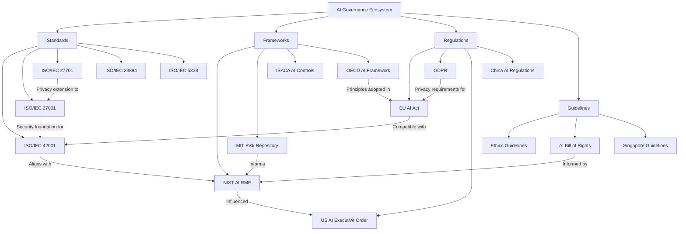
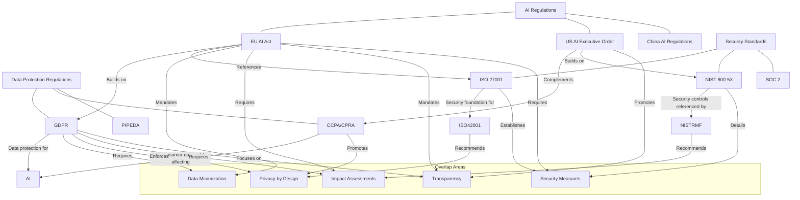
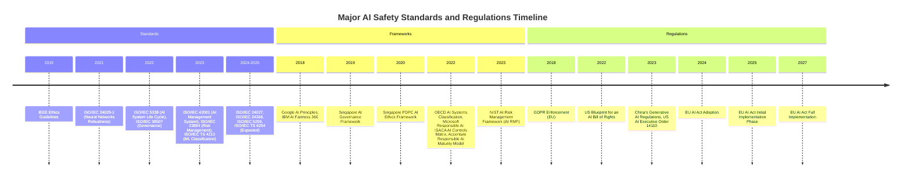

# Awesome Guide to AI Safety

A comprehensive collection of resources, frameworks, standards, regulations, and tools related to AI safety and governance.

## Table of Contents
- [ISO Standards for AI Safety](#iso-standards-for-ai-safety)
- [AI Safety Tools](#ai-safety-tools)
- [AI Risk Frameworks](#ai-risk-frameworks)
- [AI Regulations](#ai-regulations)
- [AI Incident Sources](#ai-incident-sources)
- [Framework Relationships](#framework-relationships)
- [Relationship to Other Regulations](#relationship-to-other-regulations)
- [Timeline of Standards and Regulations](#timeline-of-standards-and-regulations)

## ISO Standards for AI Safety

| Standard | Title | Description | Status |
|----------|-------|-------------|--------|
| ISO/IEC 42001 | Information technology — Artificial intelligence — Management system | Provides requirements for an AI management system, focusing on responsible development and use of AI | Published 2023 |
| ISO/IEC TS 4213 | Assessment of machine learning classification performance | Provides a methodology for assessment of ML classification performance | Published 2023 |
| ISO/IEC 23894 | AI Risk Management | Guidance on managing risks to organizations related to AI systems | Published 2023 |
| ISO/IEC 24027 | Bias in AI systems and AI aided decision making | Guidelines addressing bias in AI systems | Under development |
| ISO/IEC 24029 | Assessment of the robustness of neural networks | Guidelines for neural network robustness assessment | Part 1 published 2021 |
| ISO/IEC 24368 | AI governance implications of using AI systems | Guidance on AI governance | Under development |
| ISO/IEC 5259 | Data quality for analytics and ML | Guidelines for data quality | Multiple parts under development |
| ISO/IEC 25059 | Quality evaluation of learning capabilities in AI systems | Guidance on evaluating AI system quality | Under development |
| ISO/IEC 38507 | Governance implications of the use of AI by organizations | Provides guidance for governing bodies on AI use | Published 2022 |
| ISO/IEC 5338 | AI system life cycle processes | Framework for AI system life cycle processes | Published 2022 |
| ISO/IEC TS 6254 | Objectives and methods for explainability of ML models | Technical specification for ML explainability | Under development |

## AI Safety Tools

### Open Source Tools

| Tool | Category | Description | Link |
|------|----------|-------------|------|
| AI Fairness 360 | Fairness | Toolkit to help detect and mitigate bias in ML models | [GitHub](https://github.com/Trusted-AI/AIF360) |
| Adversarial Robustness Toolbox | Security | Library for adversarial ML security | [GitHub](https://github.com/Trusted-AI/adversarial-robustness-toolbox) |
| EthicalML | Ethics | Open-source tools for ethical machine learning | [GitHub](https://github.com/EthicalML) |
| InterpretML | Explainability | Toolkit for model interpretability | [GitHub](https://github.com/interpretml/interpret) |
| LIME | Explainability | Tool for explaining predictions of ML models | [GitHub](https://github.com/marcotcr/lime) |
| SHAP | Explainability | Tool to explain outputs of any ML model | [GitHub](https://github.com/slundberg/shap) |
| ML Privacy Meter | Privacy | Tool to quantify privacy risks in ML models | [GitHub](https://github.com/privacytrustlab/ml_privacy_meter) |
| MLflow | ML Lifecycle | Platform for managing ML lifecycle | [GitHub](https://github.com/mlflow/mlflow) |
| Model Cards Toolkit | Documentation | Tool for creating model cards | [GitHub](https://github.com/tensorflow/model-card-toolkit) |
| Foolbox | Security | Tool for testing robustness of neural networks | [GitHub](https://github.com/bethgelab/foolbox) |

### Commercial Tools

| Tool | Category | Description | Link |
|------|----------|-------------|------|
| IBM Watson OpenScale | Fairness/Monitoring | AI bias detection and fairness monitoring | [IBM](https://www.ibm.com/products/watson-openscale) |
| Microsoft Azure Responsible AI | Comprehensive | Suite of tools for responsible AI | [Microsoft](https://azure.microsoft.com/en-us/solutions/responsible-ai/) |
| Google Cloud AI | Comprehensive | AI platform with responsible AI features | [Google](https://cloud.google.com/ai) |
| Dataiku | ML Operations | Platform for data science and ML operations | [Dataiku](https://www.dataiku.com/) |
| Arthur AI | Monitoring | ML model monitoring platform | [Arthur](https://www.arthur.ai/) |
| Fiddler AI | Explainability/Monitoring | ML monitoring and explainability platform | [Fiddler](https://www.fiddler.ai/) |
| Credo AI | Governance | AI governance platform | [Credo AI](https://www.credo.ai/) |
| DotData | AutoML | Automated ML platform with governance features | [DotData](https://dotdata.com/) |
| Weights & Biases | Experiment Tracking | ML experiment tracking tool | [W&B](https://wandb.ai/) |
| Determined AI | Training Platform | ML training platform | [Determined AI](https://www.determined.ai/) |

## AI Risk Frameworks

| Framework | Organization | Description | Release Date |
|-----------|--------------|-------------|--------------|
| AI Risk Management Framework (AI RMF) | NIST | Comprehensive framework for identifying, assessing, and managing AI risks | January 2023 |
| AI Risk Repository | MIT | Repository of over 1,000 AI risks with structured taxonomies | Ongoing |
| OECD Framework for the Classification of AI Systems | OECD | Classification system for AI systems based on risk levels | February 2022 |
| Responsible AI Framework | Microsoft | Framework for responsible AI development and deployment | 2022 |
| Artificial Intelligence Risk & Controls Matrix | ISACA | Matrix for evaluating AI risks and controls | 2022 |
| AI Ethics Guidelines | IEEE | Guidelines for ethical AI development | 2019 |
| Responsible AI Maturity Model | Accenture | Framework to assess and improve responsible AI practices | 2022 |
| AI Principles | Google | Principles and practices for responsible AI | 2018 |
| AI Ethics Framework | Singapore PDPC | Guidelines for ethical use of AI | 2020 |
| AI Fairness 360 | IBM | Toolkit and framework for fairness in AI | 2018 |

## AI Regulations

| Regulation | Jurisdiction | Description | Status | Effective Date |
|------------|--------------|-------------|--------|---------------|
| EU AI Act | European Union | Comprehensive regulation of AI systems based on risk levels | Approved | Phased implementation 2024-2027 |
| GDPR (AI provisions) | European Union | Data protection regulation with AI implications | Enforced | May 2018 |
| AI Executive Order (14110) | United States | Orders for development of AI with safety, security, and trust | Issued | October 2023 |
| AI Risk Management Framework (AI RMF) | United States | Voluntary framework for managing AI risks | Released | January 2023 |
| Blueprint for an AI Bill of Rights | United States | Guidelines for protecting rights in AI systems | Released | October 2022 |
| Algorithmic Accountability Act | United States | Proposed legislation for impact assessments | Proposed | - |
| China's Generative AI Regulations | China | Regulations for generative AI models | Effective | August 2023 |
| Artificial Intelligence and Data Act (AIDA) | Canada | Proposed legislation for regulating AI | Proposed | - |
| Algorithm Act | South Korea | Regulates algorithmic recommendation systems | Proposed | - |
| AI Governance Framework | Singapore | Guidelines for responsible AI deployment | Released | 2019 |

## AI Incident Sources

| Source | Organization | Description | Link |
|--------|--------------|-------------|------|
| AI Incident Database | AIID | Repository of AI incidents and issues | [AIID](https://incidentdatabase.ai/) |
| AI Incidents Database | MIT | Database tracking AI incidents with risk taxonomy | [MIT](https://www.aiincidentdatabase.com/) |
| XRSI AI Incident Register | XRSI | Reports of privacy violations and harms from AI | [XRSI](https://xrsi.org/the-xrsi-ai-incident-register) |
| AI Vulnerabilities Database | AVID | Database of ML vulnerabilities | [AVID](https://avidml.org/) |
| Responsible AI Tracker | Montreal AI Ethics Institute | Tracking AI ethics incidents and developments | [MAIEI](https://montrealethics.ai/) |
| AI Ethics Incidents | ParthLabs | Collection of AI ethics incidents | [ParthLabs](https://parthlabs.github.io/ai_ethics_incidents/) |
| Algorithm Watch | Algorithm Watch | Monitoring AI systems and their impacts | [Algorithm Watch](https://algorithmwatch.org/) |
| AI Alignment Map | AI Alignment | Mapping AI alignment research and incidents | [Alignment Map](https://www.alignmentmap.org/) |
| AI Safety Gridworlds | DeepMind | Testing environments for AI safety | [GitHub](https://github.com/deepmind/ai-safety-gridworlds) |
| AI Testing Toolkit | Anthropic | Tools for testing AI safety | [Anthropic](https://www.anthropic.com/research) |

## Framework Relationships

Below is a Mermaid diagram showing how various frameworks, standards, and regulations are related:

## Relationship to Other Regulations

## Timeline of Standards and Regulations

## Contributing

Contributions to this repository are welcome! Please see the [CONTRIBUTING.md](CONTRIBUTING.md) file for guidelines on how to contribute.

## License

This repository is licensed under the MIT License - see the [LICENSE](LICENSE) file for details.
